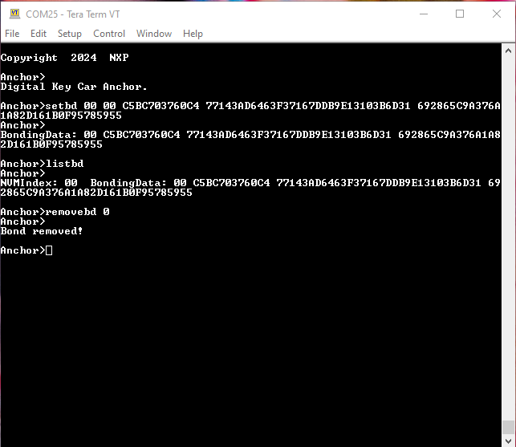

# Synchronizing bonding data between Car Anchors

**Note:** On the KW45B41Z-EVK, KW47-EVK and FRDM-KW43 platforms, this feature is only valid when Advanced Secure Mode is disabled \(`gAppSecureMode_d` is set to `0` in the `app_preinclude.h` file\). To synchronize bonding data when Advanced Secure Mode is enabled, refer to [Running the A2B scenario](running_the_a2b_scenario.md).

Multiple Car Anchors can reside on a car, acting as a single Bluetooth Low Energy device as far as the Device is concerned. When the Device pairs and bonds with a Car Anchor, that bonding data must be shared with all other anchors. To showcase this functionality, the Car Anchor shell demo offers the "`setbd`" command.

During owner pairing, the bonding data is displayed in the shell as seen in the Owner Pairing section. By passing this data to the "`setbd`" command on another Car Anchor, that anchor is able to connect with the original Device and perform the Passive Entry flow.

**Note:** Currently only the Bluetooth Low Energy bonding data is transferred between anchors. No CCC Digital Key R3-specific keys are exchanged.

Saved bonding data can also be viewed using the "`listbd`" command and a specific bond can be removed using the "`removebd`" command. See [Figure 1](../images/bondingdata.png) for details.

A bond can only be removed if a connection to that specific device is not currently active. The commands presented in this subsection are also supported on the Device for test purposes.

**Adding bonding data to a Car Anchor, listing bonds and removing a bond**

**Note:**

-   To simulate anchors residing on the same car, Random Static Address required by the Digital Key protocol and the Identity Resolving Key are set at compile time for the `digital_key_car_anchor` project. To simulate anchors residing on different cars, change the values of the *`APP_BD_ADDR`* and *`APP_SMP_IRK`* macros in the project's `app_preinclude.h`.

**Parent topic:**[Running CCC Digital Key scenarios using the Shell Interface](../topics/running_ccc_digital_key_scenarios_using_the_shell_.md)

