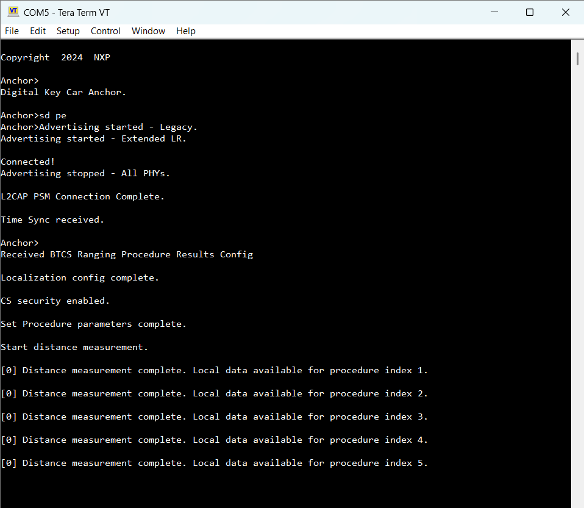
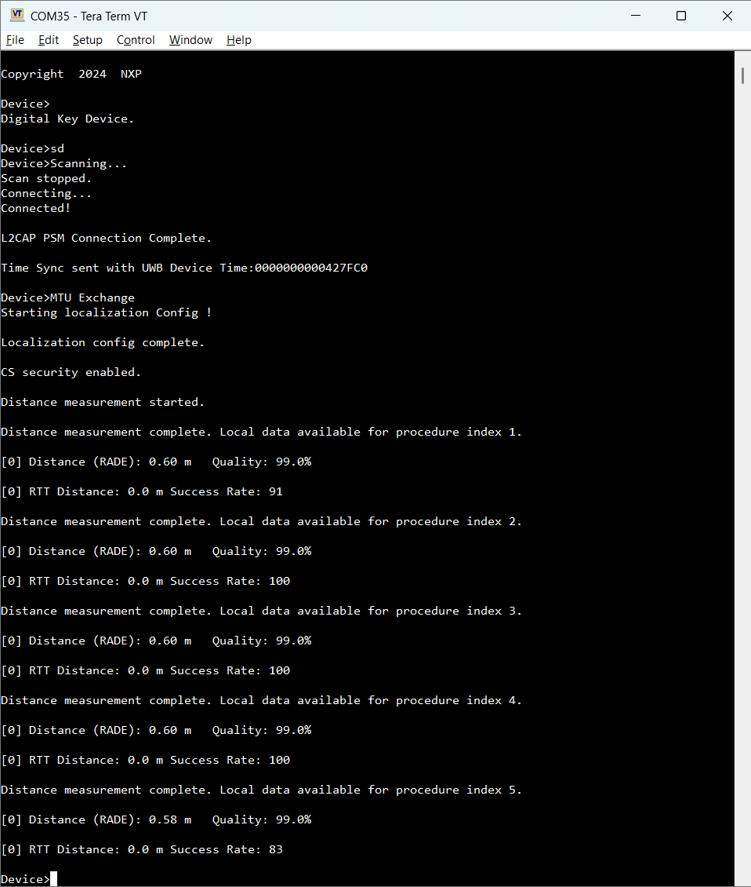

# BTCS L2CAP data transfer

The CCC introduced the Bluetooth LE Channel Sounding \(BTCS\) measurement transfer feature. BTCS procedures are configured and executed using the Bluetooth Low Energy connection established for the Digital Key Service. The results of the BTCS procedures are transferred to the vehicle and used to estimate the distance. The data transfer is done through the L2CAP channel created during the passive entry scenario. The format of the data transferred through BTCS is defined by the CCC. The algorithms used on the receiver to estimate the distance are \(RADE and CDE\).

The default transfer direction enabled in the `digital_key_car_anchor_cs` and `digital_key_device_cs` is from Device to the Anchor. To reverse the transfer direction in BTCS, the following defines must be set in the `app_preinclude.h` file:

-   `digital_key_car_anchor_cs`: `gAppBtcsClient_d` set to `0` and `gAppBtcsServer_d` set to `1`
-   `digital_key_device_cs`: `gAppBtcsServer_d` set to `0` and `gAppBtcsClient_d` set to `1`

The figure below shows the car Anchor output after BTCS transfer direction is reversed.

**BTCS transfer - car Anchor output**

The figure below shows the Device output after BTCS is enabled.

**BTCS transfer - Device output**

**Parent topic:**[Localization scenarios](../topics/localization_scenarios.md)

