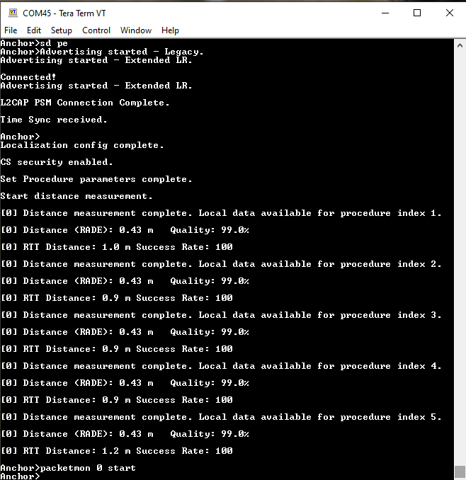
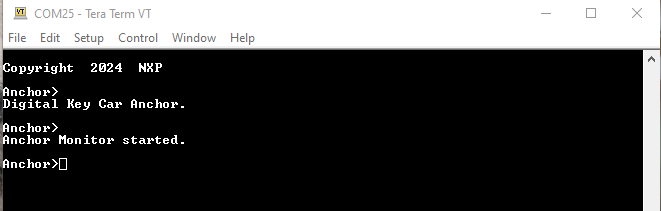
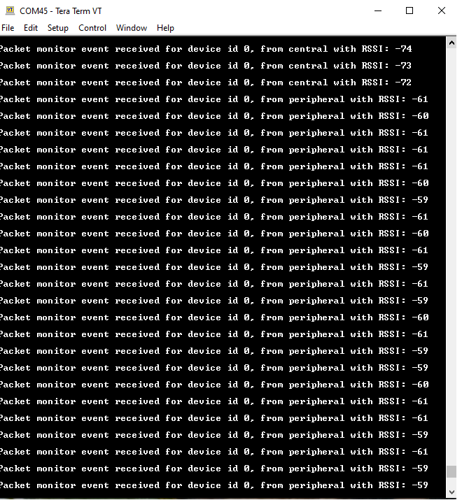

# Running the Packet Monitoring scenario

Packet Monitoring is an NXP proprietary feature that allows a second Anchor to receive the packets from the connection between the first Anchor and the Device. The prerequisites are the same hardware setup as used for the [Running the Connection Handover scenario](running_the_connection_handover_scenario.md). Note, however, that the Connection Handover scenario cannot be performed while Packet Monitoring is in progress. Packets received by the second Anchor are sent over the serial interface to the first Anchor for processing. The first Anchor determines the source of the packet based on the SN and NESN bits and displays the RSSI.

**Demo steps**:

1.  Connect the first Anchor and a Device using either the Owner Pairing or Passive Entry scenario as described in [Owner Pairing scenario](owner_pairing_scenario.md) and [Passive Entry scenario](passive_entry_scenario.md).  

 **Anchor has performed Owner Pairing and the `packetmon start` command is run**

    Anchor has performed Owner Pairing and the “`packetmon start`” command is run.

2.  Run the `packetmon start` command on the first Anchor, as shown in the figure below.

**The second Anchor starts Packet Monitoring after receiving the command over the serial interface**

3.  The second Anchor begins monitoring the connection and receives packet information, which it forwards to the first Anchor. See the figure below.

**The first Anchor displays the RSSI and source device of the received packets from the second Anchor**

4.  The first Anchor receives the packet information from the second Anchor and determines the source of the packet based on the SN and NESN bits. The source and the RSSI information is displayed in the console as shown in the preceding figure.
5.  To stop monitoring, run the `packetmon stop` shell command on either Anchor. It is recommended to use the second Anchor, whose console is not flooded by packet information messages.

**Parent topic:**[Running the Connection Handover scenario](../topics/running_the_connection_handover_scenario.md)

