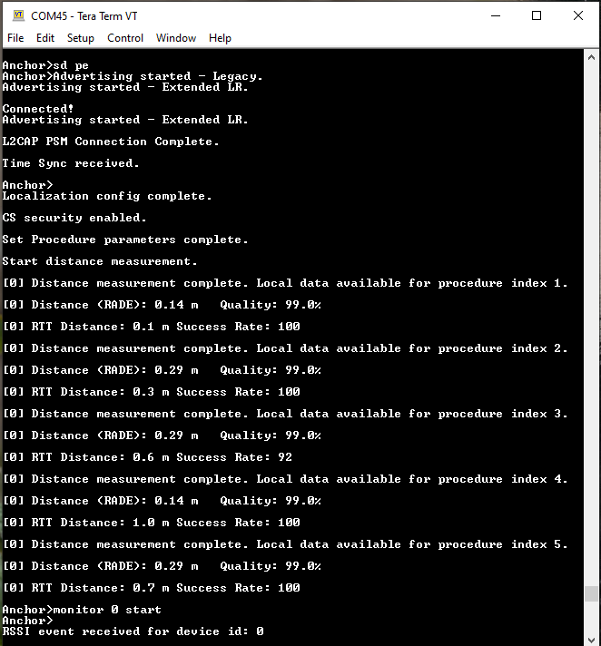
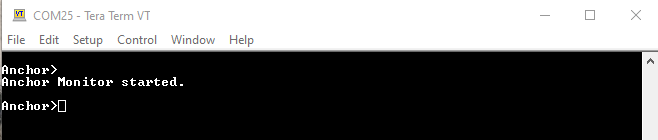
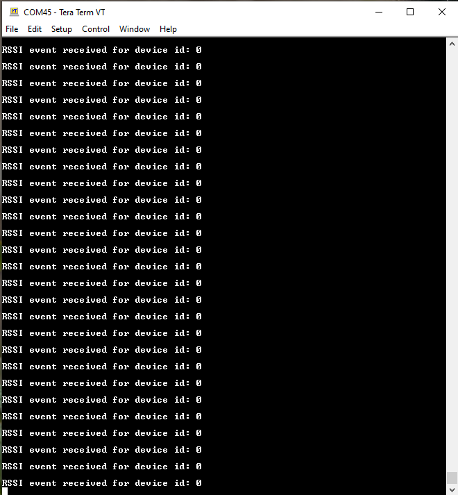

# Running the Anchor Monitoring scenario

Anchor Monitoring is an NXP proprietary feature that allows a second Anchor to monitor the connection between the first Anchor and the Device. The feature requires the same hardware setup as used for the Connection Handover scenario. Note, however, that the Connection Handover scenario cannot be performed while Anchor Monitoring is in progress.

**Demo steps:**

1.  Connect a Car Anchor and a Device using either the Owner Pairing or Passive Entry scenario as described in [Owner Pairing scenario](owner_pairing_scenario.md) and [Passive Entry scenario](passive_entry_scenario.md).

    **Anchor has performed Owner Pairing and the `monitor start` command is run**

2.  Run the “`monitor start`” shell command on the Car Anchor, as shown in the figure below

    **The second Anchor has received the command over the serial interface and has started Anchor Monitoring**

3.  The second Car Anchor begins monitoring the connection and receives RSSI info events, which it forwards to the first Car Anchor. The received RSSI messages are then displayed on the console. This is shown in the figure below.

    **The first Anchor displays RSSI events received from the second Anchor**

4.  To stop monitoring, run the `monitor stop` shell command on either of the Car Anchors \(the second one is recommended, as its console is not flooded by RSSI event messages\).

**Parent topic:**[Running the Connection Handover scenario](../topics/running_the_connection_handover_scenario.md)

