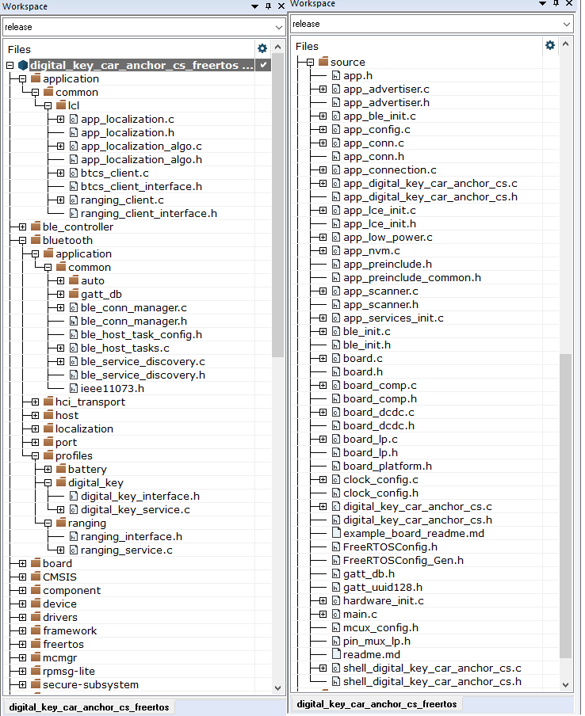

# Deploying CCC Digital Key application software

The software package includes the components necessary for CCC Digital Key R3 application development on the selected NXP platform. These components include:

-   Bluetooth Low Energy Host software libraries
-   Channel Sounding and Localization algorithm libraries
-   NBU images binaries
-   Examples of demo application projects corresponding to CCC Digital Key roles \(Device and Car Anchor\)
-   Platform peripheral drivers, platform startup code, other generic platform software

**Note:** Prior to loading any wireless SDK example, update your NBU image with the provided binaries, with Channel Sounding (CS) support, in the following folder of the SDK:

`../middleware/wireless/ble-controller/bin`.

The demo applications were compiled and tested with **IAR Embedded Workbench for Arm** and **ARMGCC**. Users are recommended to use one of these tools.

To open, build, and run any example application, see the Bluetooth Low Energy Quick Start Guide document of the corresponding board. The CCC Digital Key R3 examples are built and run in the same fashion as Bluetooth Low Energy examples.

The application folder structure for the *digital_key_car_anchor_cs* project can be described as the following:

-   The main application source files are the `source/digital_key_car_anchor_cs.c` and `source/app_digital_key_car_anchor_cs.c`.
-   The files in `bluetooth/profiles/digital_key` implement the Digital Key Service defined by the CCC Digital Key R3 specification.
-   The application files for the localization functionality, are `/application/common/lcl/app_localization.c` and `application/common/lcl/app_localization_algo.c`.
-   The files `/application/common/lcl/btcs_server_interface.h` and `/application/common/lcl/btcs_server.c` implement the BTCS Server functionality.
-   The files `/application/common/lcl/btcs_client_interface.h` and `/application/common/lcl/btcs_client.c` implement the BTCS Client functionality.

The below figure shows the application folder structure for the *digital\_key\_car\_anchor\_cs* project.

**Application folder structure in workspace**

