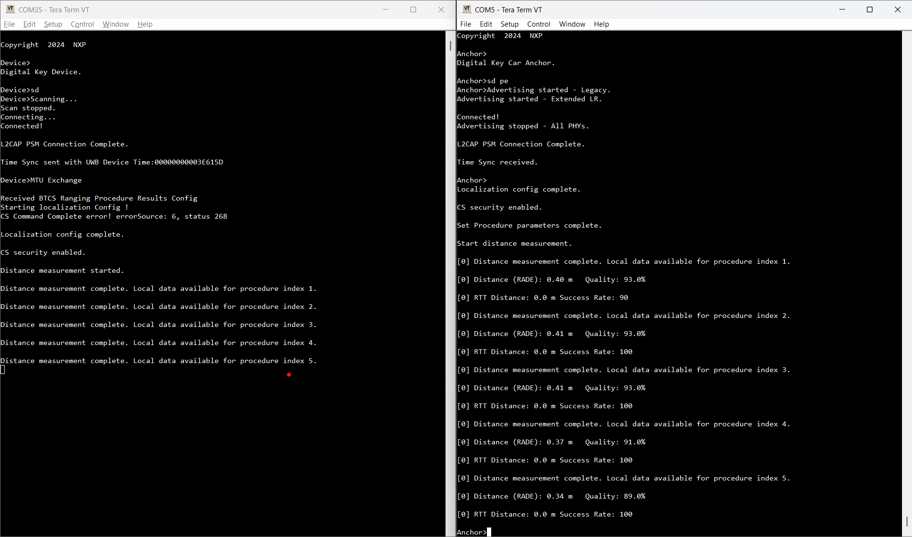

# Localization after passive entry

The localization process starts automatically after the Passive Entry scenario is completed. The CS Initiator performs the CS setup and starts a number of `gCsProcRepeatMaxNumProcedures_c` procedures. After each procedure, the Device’s local data is transmitted through BTCS to the Anchor. After the Anchor collects the data, it runs the selected algorithm\(s\) and displays the measured distance \(meters\) in the console.

The below figure shows the output of the localization process after each of the five measurements completed successfully and the distance is displayed.

**Output of the localization process**

**Parent topic:**[Localization scenarios](../topics/localization_scenarios.md)

