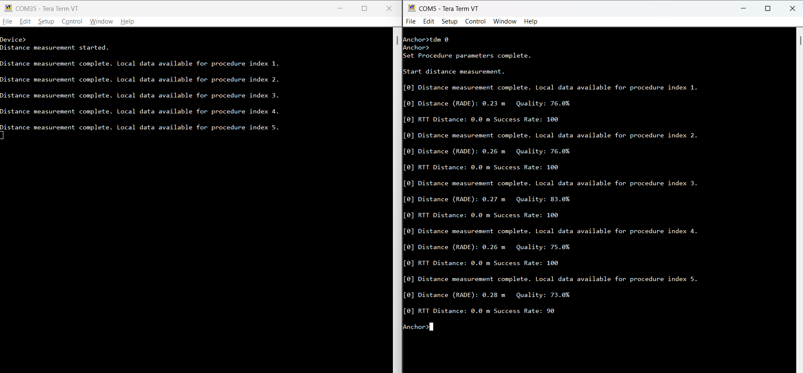

# Localization on demand and other shell commands

Localization can also be performed on demand via the `tdm` shell command, which takes the device ID of the peer as an argument. As shown in the figure below, the Device triggers the localization process, and the default 5 measurements complete successfully.

**Triggering the localization process**

Other available shell commands are:

-   `setcsconfig`: This command overwrites the default parameters for the *Channel Sounding Create Config* command. It takes the following parameters, in the order below:
    -   `peerId`
    -   `mainModeType`: CS mode to be used as main mode during the CS procedure for this configuration. Possible values:
        -   1 (CS mode-1)
        -   2 (CS mode-2)
        -   3 (CS mode-3)
    -   `subModeType`: CS mode to be used as submode during the CS procedure for this configuration. Possible values:
        -   1 (CS mode-1)
        -   2 (CS mode-2)
        -   3 (CS mode-3)
        -   255 (no submode used)
    -   `mainModeMinSteps`: Lower bound of the range of main mode CS steps to be executed before a submode CS step is executed during the CS procedure. Range:
        -   1 to 255
    -   `mainModeMaxSteps`: Higher bound  of the range of main mode CS steps to be executed before a submode CS step is executed during the CS procedure. Range:
        -   1 to 255
    -   `mainModeRepetition`: Number of main mode CS steps repeated from the previous CS subevent at the beginning of the current CS subevent. Range:
        -   0 to 3
    -   `mode0Steps`: Number of CS mode-0 steps to be included at the beginning of each CS subevent. Range:\
        -   1 to 3
    -   `role`: CS role. Possible values:
        -   0 (initiator)
        -   1 (reflector)
    -   `RTTType`: RTT variant to be used during the CS procedure. Possible values:
        -   0 (RTT AA only)
        -   1 (RTT with 32-bit sounding sequence)
        -   2 (RTT with 96-bit sounding sequence)
        -   3 (RTT with 32-bit random sequence)
        -   4 (RTT with 64-bit random sequence)
        -   5 (RTT with 96-bit random sequence)
        -   6 (RTT with 128-bit random sequence)
    -   `channelMap`: 80-bit map in big endian order indicating channels to be used for the CS procedure. The default value is `fcff7ffcffffffffff1f` (all channels used except 0, 1, 23-25 and 77-78). Bit 79 is reserved for future use. At least 15 channels must be enabled.
    -   `channelMapRepetition`: Number of times the channel map will be cyled through for non-mode-0 steps within a CS procedure. Range:
        -   1 to 255.
    -   `channelSelectionType`: Possible values:
        -   0 (Channel Selection Algorithm #3b)
        -   1 (Channel Selection Algorithm #3c)
    -   `cs_sync_phy`: PHY to be used for CS_SYNC exchanges during the CS procedure for the specified CS configuration. Possible values:
        -   1 (LE 1M PHY)
        -   2 (LE 2M PHY)
        -   3 (LE 2M 2BT PHY)
-   `setcsproc`: This command overwrites the default parameters for the *Channel Sounding Set Procedure Parameters* command. It takes the following parameters, in the order below:
    -   `peerId`
    -   `maxProcedureDuration`: Maximum duration for each CS procedure. Range:
        -   1 to 65535 (units of 0.625ms)
    -   `minPeriodBetweenProcedures`: Minimum number of connection events between consecutive CS procedures. Range:
        -   1 to 65535
    -   `maxPeriodBetweenProcedures`: Maximum number of connection events between consecutive CS procedures. Range:
        -   1 to 65535
    -   `maxNumProcedures`: Maximum number of CS procedures to be scheduled. Possible values:
        -   0 (CS procedures to continue until disabled)
        -   1 to 65535
    -   `minSubeventLen`: Minimum suggested duration for each CS subevent in microseconds. Range:
        -   1250 microseconds to 3.999999 seconds
    -   `maxSubeventLen`: Maximum suggested duration for each CS subevent in microseconds. Range:
        -   1250 microseconds to 3.999999 seconds
    -   `antCfgIndex`: Antenna Configuration Index as described in the Core specification. Range:
        -   0 to 7
-   `verbosity`: Sets the verbosity level during the CS procedure.
-   `setnumprocs`: This command overwrites the default value `gCsProcRepeatMaxNumProcedures_c` parameter for the CS Procedure Repeat. It takes the following parameters, in the order below:

    -   `peerId`
    -   `maxNumProcedures`: Number of procedures in hex format. Example: `setnumprocs 0 0x0005`.

**Parent topic:**[Localization scenarios](../topics/localization_scenarios.md)

