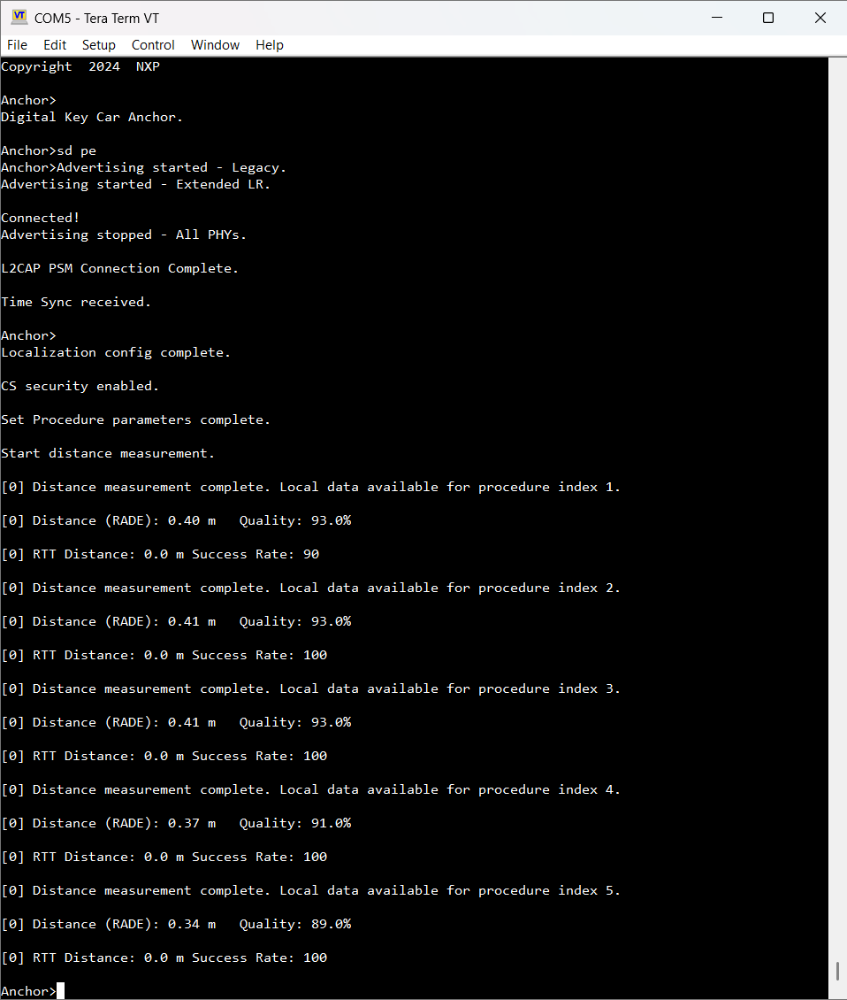
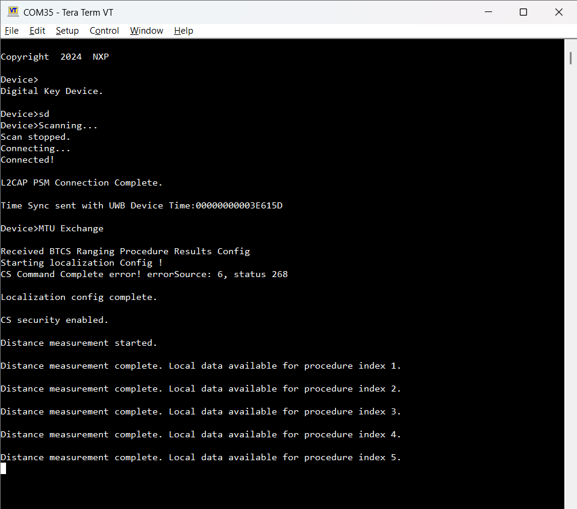

# Passive Entry scenario

The Passive Entry scenario runs after owner pairing between a Car Anchor and a Device has successfully completed. First, reset the recently paired boards using either the RST switch or the "`reset`" command in the shell. Alternatively, disconnect using the `dcnt` shell command.

**Note:** **Do not perform a factory reset** as this step removes the bonding information from the non-volatile memory.

After reset or disconnect, run the "`sd`" command on the Device and the "`sd pe`" command on the Car Anchor. For the Passive Entry scenario, the Car Anchor advertises using two sets, one Legacy on the 1M PHY and one Extended on the Coded PHY. Since bonding data is present, they follow the Passive Entry flow, stopping after the successful creation of the L2CAP channel. The application is functional after this step. Similar to the Owner Pairing scenario, the applications implement only the Bluetooth Low Energy functionality.

**Note:** The CCC specification requires using the coding scheme S=2 for Coded PHY advertising, equivalent to a data rate of 500 Kbits per second. To experiment with other coding schemes, change the advertising parameters in *`app_config.c`* for the `*digital_key_car_anchor_cs*` project.

The output of the `sd` and `sd pe` commands is shown in the figures below.

**Passive Entry on Car Anchor**

**Passive Entry on Device**

**Parent topic:**[Running CCC Digital Key scenarios using the shell interface](../topics/running_ccc_digital_key_scenarios_using_the_shell_.md)

