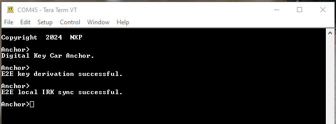
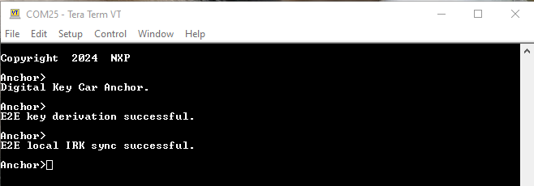
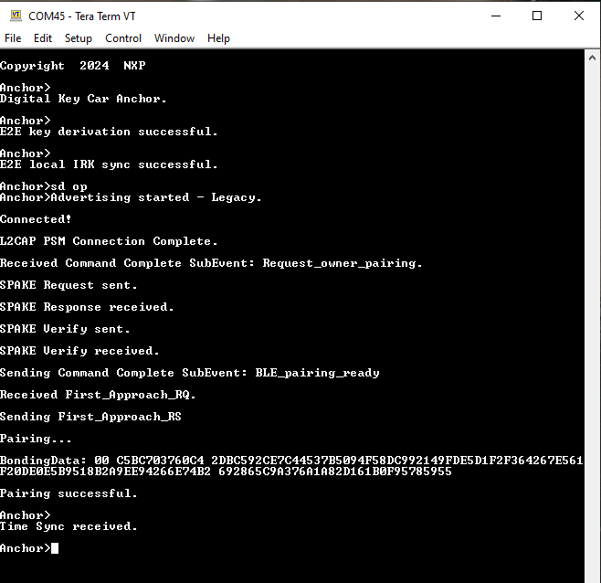
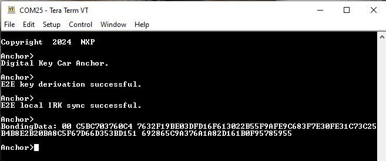
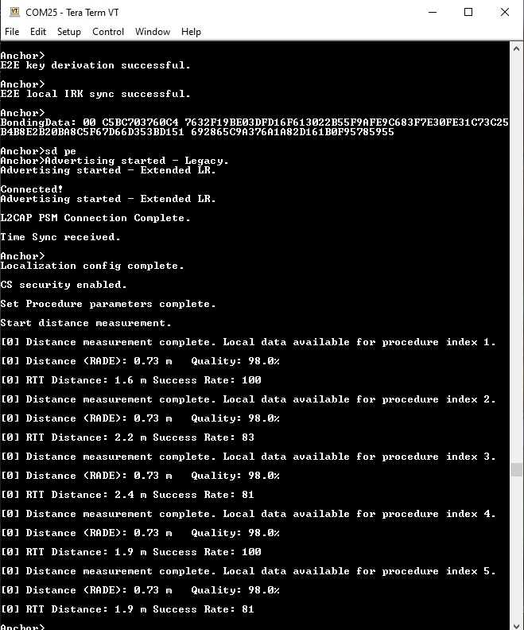

# Running the A2B scenario

The A2B feature allows for the secure transfer of Bluetooth Low Energy security keys information between the Car Anchor devices. The feature is supported on the following platforms:

-   KW47-EVK with a life cycle state of OEM-Open or higher, this feature is provided by th EdgeLock Secure Enclave.

-   FRDM-KW43 with a life cycle state of OEM-Open or higher, this feature is provided by the EdgeLock Secure Enclave.

The Car Anchor demo application makes use of the A2B feature to securely synchronize the local Identity Resolving Key \(IRK\) and the Bonding Data \(LTK Long Term Key and peer IRK\) with another Car Anchor.

**Prerequisites**:

-   Three boards \(two act as Car Anchors, one as a Device\). The demo is currently limited to a maximum of two Car Anchors.
-   The two Car Anchors must be connected via a serial interface as described in the section above.
-   Advanced Secure Mode must be enabled. The following macros must be defined and set to `1` in `*app_preinclude.h*` for the ***digital\_key\_car\_anchor\_cs*** project:
    -   *`gAppSecureMode_d`*
    -   *`gA2BEnabled_d`*
-   One of the Car Anchors must be configured with the `*gA2BInitiator_d*` macro set to `1`, this is called Car Anchor A, and the other must be configured with the `*gA2BInitiator_d*` macro set to `0`, called Car Anchor B. Car Anchor A triggers the EdgeLock-to-EdgeLock \(E2E\) key derivation and local IRK synchronization. Therefore, it should be started up after Car Anchor B.

**Demo steps**:

-   Start Car Anchor B, then Car Anchor A. At initialization the E2E key is derived and the local IRK of Car Anchor A is sent as a secure blob to Car Anchor B in order for both Car Anchors to have the same local IRK. This process is shown in the figure below.

**Car Anchor A starts up, derives the E2E key and syncs with Car Anchor B**

-   The below figure shows the Car Anchor B starting up and syncing with Car Anchor A.

**Car Anchor B starts up and syncs with Car Anchor A**

-   Trigger the Owner Pairing scenario by sending the "`sd`" command on the Device and "`sd op`" on Car Anchor A. Once the bond is created, the Bonding Data containing secured blobs for the LTK and peer IRK is sent to Car Anchor B. The Car Anchors print the Bonding Data in shell with the LTK in blob form \(the LTK is never available in plain text\) and the peer IRK in plain text. Now both Car Anchors have the same Bonding Data. The figure below shows that the Car Anchor A pairs with the Device.

**Car Anchor A pairs with Device**

The figure below shows that the Car Anchor B receives the Bonding Data via the serial interface.

**Car Anchor B has received the Bonding Data via the serial interface**

-   Disconnect Car Anchor A by sending the `dcnt` command.
-   Once Car Anchor A is disconnected, run the `sd` command on the Device and run the `sd pe` command on Car Anchor B. Car Anchor B is now able to perform a Passive Entry connection, without pairing. The below figure shows the process.

**Car Anchor B performs Passive Entry without pairing**

