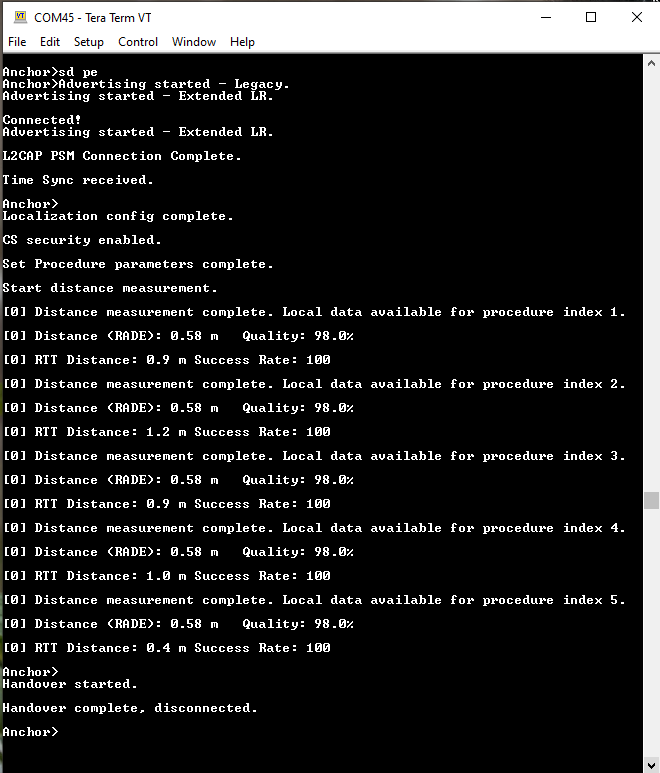
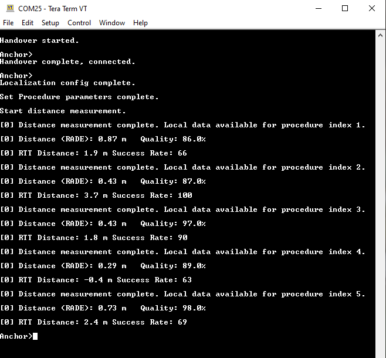

# Running the Connection Handover scenario

Connection Handover is an NXP proprietary feature that enables seamless transfer of a Bluetooth Low Energy connection from one peripheral to another while the central device remains unaware. The CCC Digital Key use case best exemplifies this scenario but is not limited to it. As a person carrying a phone moves around the vehicle, the Bluetooth Low Energy connection is transferred between Car Anchors to ensure the best user experience. From the point of view of the Device, it stays in the same initial connection.

The CCC Digital Key demos showcase the Connection Handover feature. The handover is performed on demand via a button press. In a real scenario, the handover is performed based on criteria such as RSSI. The following hardware platforms support this feature:

-   KW47-EVK
-   KW47-LOC board
-   FRDM-KW43

**Prerequisites**:

-   Three boards \(two boards act as Car Anchors, one as a Device\). The demo is limited to a maximum of two Car Anchors.
-   The two Car Anchors must have a serial connection via the secondary UART. The UART connection stands in for a real deployment solution such as a CAN bus. The table below describes the connections for each supported board.

    | Board | UART RX → TX | UART TX → RX | GND |
    |-------|-------------|-------------|-----|
    | KW47-EVK | J1-1 → J1-3 | J1-3 → J1-1 | J13-8 to J13-8 |
    | KW47-LOC | J2-3 → J2-4 | J2-4 → J2-3 | J2-8 → J2-8 |
    | FRDM-KW43 | J22-1 (UART0\_RX PTA18) → JP19-1 (UART0\_TX PTA17) | JP19-1 → J22-1 | J21-8 to J21-8 |

    **Note:** For FRDM-KW43, the current firmware configuration uses PTA18 for UART0\_RX instead of PTA16 as shown in the schematic.
-   The *gHandoverIncluded\_d* macro must be set to `1` in *`app_preinclude.h`* for the ***digital\_key\_car\_anchor\_cs*** project.
-   The CS configuration must exist on the initial Car Anchor before the first handover is performed, as detailed in the Demo steps below.

    **Two Car Anchors connected via the secondary UART**


**Demo steps**:

-   Connect a Car Anchor and a Device using the Passive Entry scenario as described in the section [Passive Entry scenario](passive_entry_scenario.md).
-   Press the **SW3** switch on the Car Anchor which is connected to the Device.
-   The connection is handed over to the second Car Anchor as seen in console messages. LED2 also turns solid blue on the Car Anchor that takes over the connection.
-   **Optional**: Use the "`send`" shell command on the Car Anchor that has taken over the connection. The message is displayed in the console on the Device, after the Passive Entry scenario has completed and CS procedures have run.
-   The connection can also be continually handed over back and forth between the two Car Anchors. To perform this step, press the **SW3** switch on the Car Anchor that currently has the connection.

As shown in the below figure, the first Car Anchor performs the Passive Entry scenario, followed by the CS procedures resulting in distance measurements. The handover is then triggered via button press.

**First Car Anchor performs the Passive Entry scenario and distance measurements**



The figure below shows that the second Car Anchor takes over the connection. The default role for the Car Anchor is CS Initiator. Therefore, it automatically triggers new CS procedures resulting in distance measurements. The "`tdm`" shell command can be used to trigger new distance measurements from either the Device or the Car Anchor.

**Second Car Anchor takes over the connection**




```{include} ../topics/Running_the_anchor_monitoring_scenario.md
:heading-offset: 1
```

```{include} ../topics/Running_the_Packet_Monitoring_scenario.md
:heading-offset: 1
```

