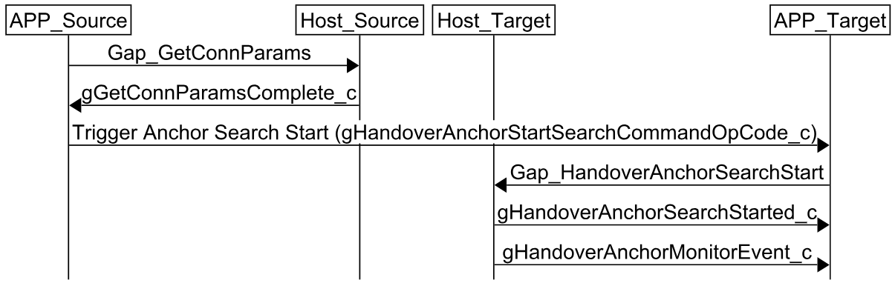

# Anchor Search

The Anchor Search procedure takes the connection parameters and timing information obtained in the Time Synchronization procedure to locate the anchor point of the connection between the source device and the connected device.

**Anchor Search steps**
1. Source device calls `Gap_GetConnParams()` to retrieve current connection parameters. The connection parameters will be reported through the gGetConnParamsComplete_c event.
2. Send the connection parameters and the timing information obtained from Time Synchronization to the Target device.
3. On the Target device, call `Gap_HandoverAnchorSearch()` with the received connection parameters and timing information. Set the 'mode' parameter according to the current process:
   - 'gSuspendTxMode_c' for Connection Handover.
   - 'gRssiSniffingMode_c' for Anchor Monitoring.
   - 'gPacketMode_c' for Packet Monitoring.
4. Wait for the `gHandoverAnchorSearchStarted_c` event to confirm the Anchor Search procedure has started.
5. If Anchor Search is successful the requested events will be reported to the application through the `gHandoverAnchorMonitorEvent_c` or `gHandoverAnchorMonitorPacketEvent_c` event.

**Anchor Search signaling chart**

