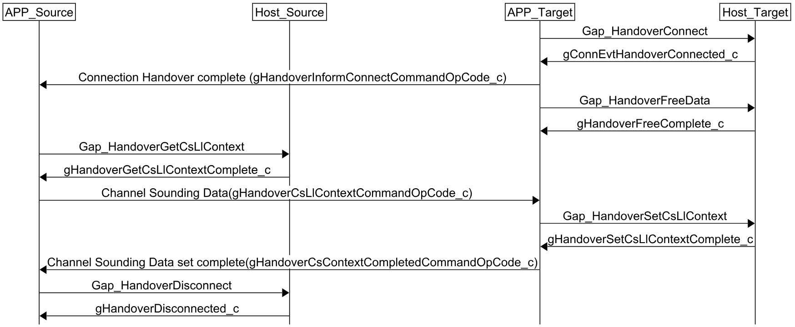

# Connection Handover

The Connection Handover procedure may be performed after a successful Anchor Search procedure and consists in the Target device taking over the connection from the Source device.

**Connection Handover steps**
1. Target device calls `Gap_HandoverConnect()` to initiate the connection handover process.
2. Wait for the `gConnEvtHandoverConnected_c` event on the Target device. Once received, the connection has been successfully transferred.
3. Notify the Source device that the Target device has successfully connected to the Device.
4. If the application does not include Channel Sounding, call `Gap_HandoverDisconnect` on the Source device to terminate its connection.
5. The Handover Data is no longer required and may be freed by calling `Gap_HandoverFreeData()` on the Target device.
6. Application context may be transferred at this point through application specific means. If Channel Sounding is enabled in the application, the Channel Sounding Context must be transferred.

Additional steps for Channel Sounding applications:
1. After step 3 above, retrieve the Channel Sounding context on the Source device by calling `Gap_HandoverGetCsLlContext()` and wait for the`gHandoverGetCsLlContextComplete` event.
2. Send the Channel Sounding context to the Target device.
3. Set the context in the Target device by calling `Gap_HandoverSetCsLlContext()` and wait for the `gHandoverSetCsLlContextComplete_c` event.
4. Notify the Source device that the Channel Sounding context has been successfully set.
5. Call `Gap_HandoverDisconnect()` on the Source device to terminate its connection. When complete, the `gHandoverDisconnected_c` event will be sent.

**Connection Handover signaling chart**

