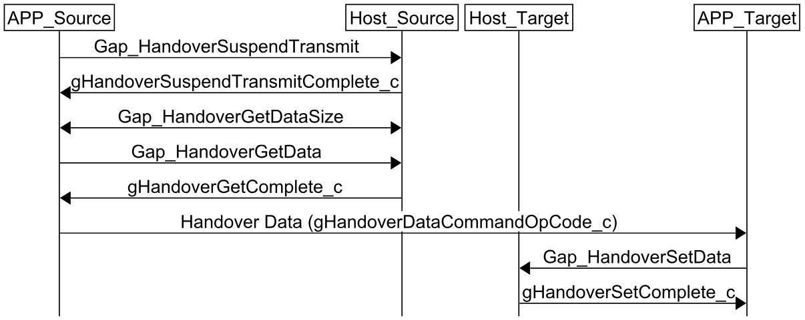

# Context Synchronization

In order to transfer an existing connection from a Source device to a Target device, the Host and Link Layer connection context must be synchronized. The Handover Data includes all the required connection information, which must be retrieved from the Source device and transferred to the Target device. Potential issues include instances where the Host or Link Layer context is updated during the Connection Handover process. To avoid such issues, the Bluetooth LE communication between the Source device and the connected device must be suspended until the Connection Handover is complete or aborted. In case the Connection Handover process is aborted, the original connection can be resumed. This procedure is required only for the Connection Handover process and not for the Anchor/Packet Monitoring process.

**Context Synchronization steps**
1. Source device calls `Gap_HandoverSuspendTransmit()` to suspend the Bluetooth LE communication with the connected device.
2. After the `gHandoverSuspendTransmitComplete_c` event is received, the Handover Data may be retrieved using `Gap_HandoverGetData()`. The application must provided memory for the Handover Data. To obtain the required data size, use the function `Gap_HandoverGetDataSize()`.
3. Wait for the `gHandoverGetComplete_c`  event to confirm the Handover Data retrieval.
4. Transfer the Handover Data from the Source device to the Target device.
5. On the Target device, call `Gap_HandoverSetData()` to set the received Handover Data.
6. Wait for the `gHandoverSetComplete_c` event to confirm the Handover Data has been successfully set.

**Context Synchronization signaling chart**

