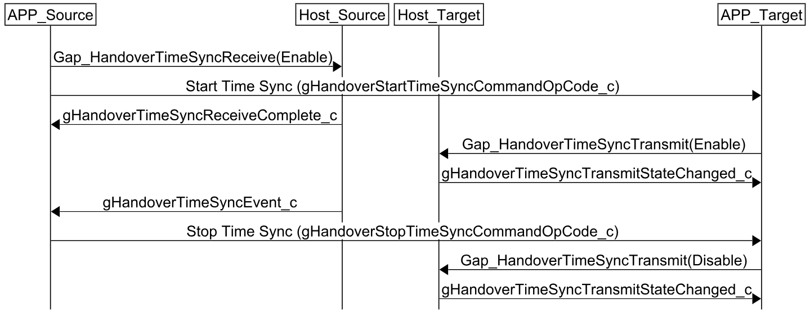

# Time synchronization

The Time Synchronization procedure enables precise timing alignment between the Source and Target devices for the Connection Handover and Anchor/Packet monitoring processes. The timing information obtained is further required for the Anchor Search procedure.

To start the time synchronization procedure, one of the devices must call `GAP_HandoverTimeSyncReceive()` and the other device must call `GAP_HandoverTimeSyncTransmit()`. Either device, Source or Target, can initiate the procedure. The Connection Handover application common module initiates the procedure on the Source device by calling the `Gap_HandoverTimeSyncReceive()` function.

**Time Synchronization steps**

Time synchronization steps for two devices where the connected device starts the procedure:
1. Source device application calls `GAP_HandoverTimeSyncReceive()` with the `stopWhenFound` parameter set to 'gTimeSyncStopWhenFound_c'.
2. Target device application calls `GAP_HandoverTimeSyncTransmit()`
3. Source device receives the 'gHandoverTimeSyncReceiveComplete_c' event indicating that Source Link Layer is waiting for the time synchronization event.
4. Target device receives the 'gHandoverTimeSyncTransmitStateChanged_c' event indication that time synchronization transmission is enabled.
5. The Source device receives the 'gHandoverTimeSyncEvent_c' event containing the timing information.
6. The Source device computes the Anchor Search 'timingDiffSlot' and 'timingDiffOffset' using the timing information received in the `gHandoverTimeSyncEvent_c` event as shown below:
   'timingDiffSlot = txClkSlot - rxClkSlot;'
   'timingDiffOffset = txUs - rxUs;'

**Time Synchronization signaling chart**

