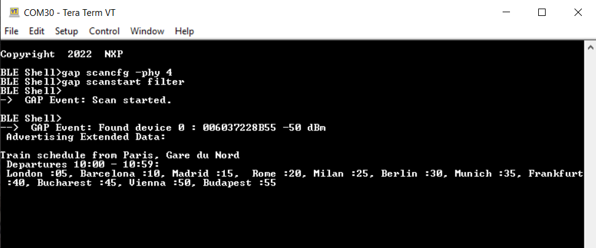
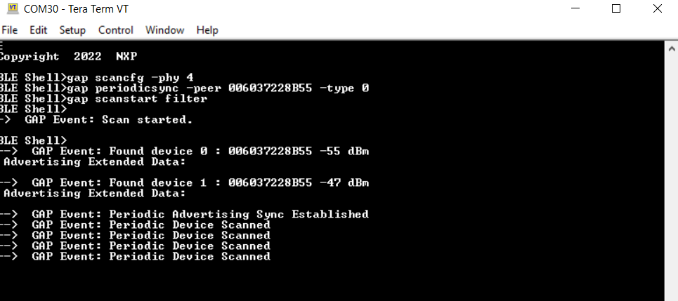

# Beacon usage with extended advertising

To use the Beacon application with the advertising extensions capabilities, the `gBeaconAE_c define` option must be set to 1. Doing this enables the usage of extended advertising and periodic advertising. The application cycles between these modes are in the following manner:

-   The first **ADVSW** press starts legacy advertising, **CONNLED** turns solid.

-   The second **ADVSW** press stops legacy advertising and starts extended advertising, **CONNLED** turns off, **EXTADVLED** turns solid.

-   The third **ADVSW** press stops extended advertising carrying data and then starts extended advertising without data and periodic advertising, **EXTADVLED** starts flashing.

-   The fourth **ADVSW** press stops periodic advertising and extended advertising without data and starts legacy advertising and extended advertising, both **CONNLED** and **EXTADVLED** turn solid.

-   The fifth ADVSW press stops them all, both **CONNLED** and **EXTADVLED** turn off.

Not all smartphones support extended advertising, hence a different method to view the AE beacon is to use the `ble_shell` application. In order to do this, perform the following steps:

1.  Flash a board with the beacon application, as described above.
2.  Flash a board with the ble\_shell application, as described in [Bluetooth LE Shell](bluetooth_le_shell.md) and connect to it using a serial port.
3.  Press the **ADVSW** button two times on the beacon to start extended advertising on the coded PHY.
4.  To view the advertising data, enter the following commands in the shell terminal to set the scanning PHY to coded and start scanning. See the figure below.  
    |

5.  To start the periodic advertising, press **ADVSW** button again on the beacon.
6.  To sync with the beacon, issue the following commands on the shell terminal as shown in the figure below.

    |

    The peer parameter of the `periodicsync` command is the public address of the beacon.

## Extended Advertising with very large data

To use very large advertising data for extended advertising, set the `gBeaconLargeExtAdvData_c` `define` to 1. The same steps are used to view the data using `ble_shell` :

1.  Flash a board with the beacon application.
2.  Flash a board with the ble\_shell application, as described in [Bluetooth LE Shell](bluetooth_le_shell.md) and connect to it using a serial port.
3.  Press the **ADVSW** button two times on the beacon to start extended advertising on the coded PHY.
4.  To view the advertising data, enter the following commands in the shell terminal to set the scanning PHY to coded and start scanning. See the figure below.

    ")

**Parent topic:**[Beacon](../topics/beacon.md)

