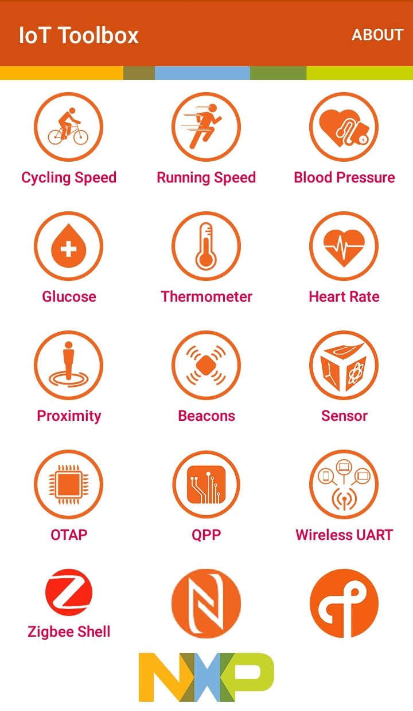
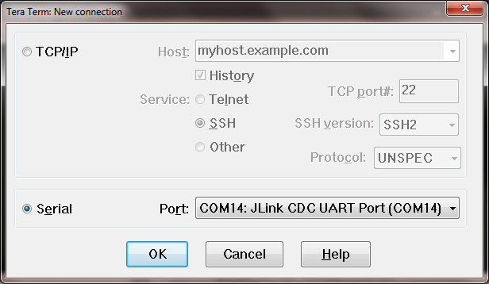
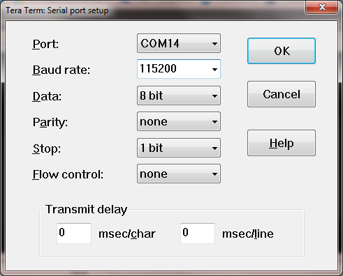
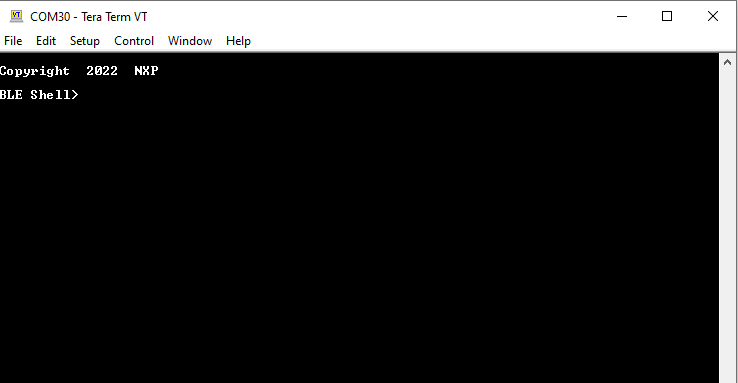

# Testing devices

To demonstrate the profile functionality, most of the scenarios require one of the supported platforms and a Bluetooth Low Energy capable central device. The device is usually a smartphone or a tablet that runs a compatible Bluetooth LE application. The figure below shows the **IoT Toolbox** UI.

**IOT toolbox**

The recommended application is the IoT Toolbox, which can be installed on Apple iOS or Android OS handheld devices that support Bluetooth Low Energy. The application can be found on [Apple Playstore](https://apps.apple.com/pl/app/iot-toolbox/id1362450908) or on [Google Play](https://play.google.com/store/apps/details?id=com.freescale.kinetisbletoolbox).

Other demos can be run by using two platforms, one for the peripheral and one for the central role. A few examples of such demos are listed below:

-   Low-Power Temperature Sensor and Collector
-   Wireless UART
-   OTAP Client and Server
-   HID Host and Device
-   Extended Advertising Central and Peripheral
-   EATT Central and Peripheral

To provide feedback and more interaction, some examples use a shell console via the virtual COM port. To access the device, open a serial port terminal and as shown in the figure below. For this example, Tera Term VT and a KW45B41Z-EVK or K32W148-EVK, or a FRDM-MCXW71 board can be used. The communication parameters are 115200 and 8N1.

Connect it to the platform with parameters as shown in the figure below .

The start screen is displayed after the board is reset as shown in the figure below .

**Parent topic:**[Building and running a Bluetooth LE example application](../topics/building_and_running_a_bluetooth_le_example_applic.md)

