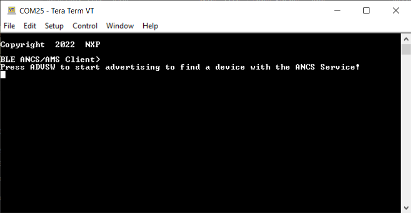
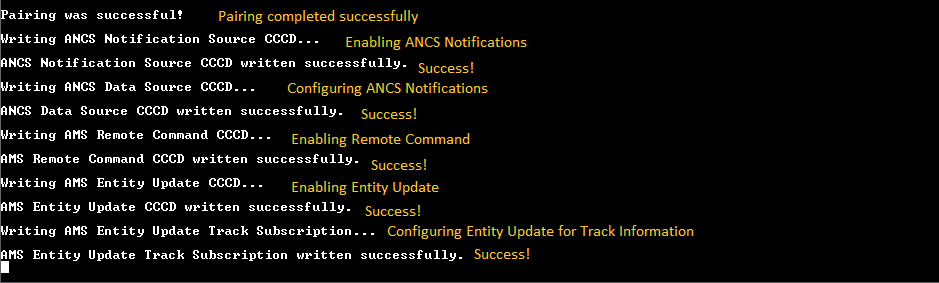
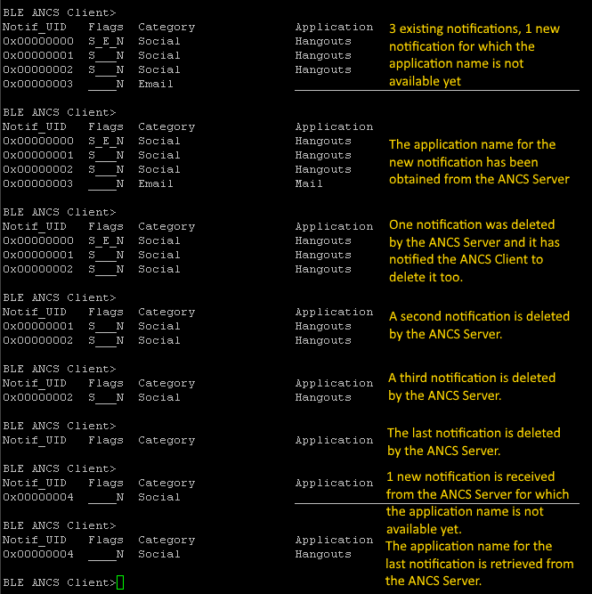
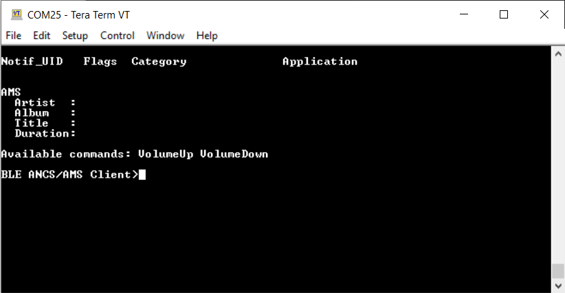
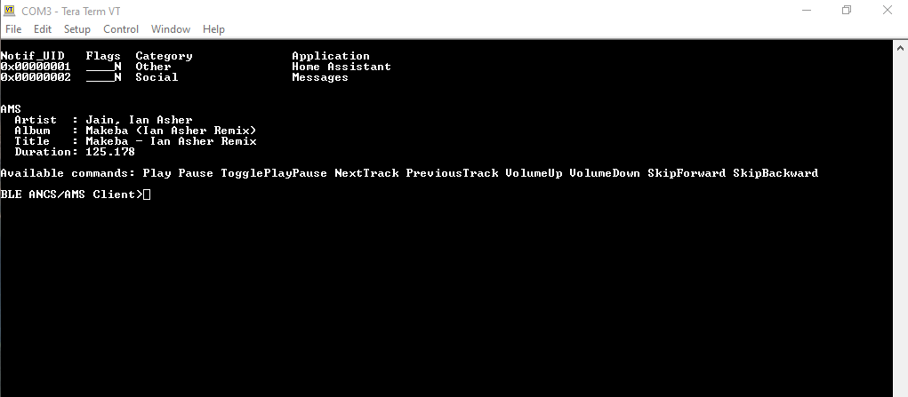

# Usage

The ANCS/AMS Client demo application is designed to work with a peer mobile device that exposes the ANCS and AMS service. Also, a serial terminal application is required for displaying ANCS Notifications information and AMS commands and information.

1. Open a serial terminal application on the PC and connect it to the serial port corresponding to the board on which the ANCS/AMS Client runs. See the details in [Testing devices](testing_devices.md), "User Interface". A start screen is displayed immediately after the board is reset. All LEDs must be flashing as shown in the figure below.   

     **Start screen for ANCS/AMS Client demo application**
   

2. Press the **ADVSW** button to start advertising. This instruction is also displayed in the serial terminal as shown in the figure above.
3. The peer device starts scanning for Bluetooth LE devices and connects to the ANCS/AMS Client device that is advertising.
4. Once connected to a peer, the application looks for the ANCS Service and AMS Service and their characteristics. If they are found, the ANCS Client tries to register for receiving notifications and AMS for the tracking data and commands. See [Figure](../images/image_24_2.png).
5. If any security-related ATT errors are encountered, then the application automatically performs Pairing and Bonding and retries the failed ATT operations. Depending on the negotiated pairing method, user interaction might be needed to complete the Pairing. Follow the onscreen instructions provided by both the ANCS/AMS Client and the mobile device. If the ANCS/AMS Client generates a passkey, then the default 999999 passkey is used. See the figure below that shows a 'Pairing is successful' message.   

    **Pairing is successful message**
    

6. After bidirectional communication is established via GATT, the ANCS/AMS Client starts displaying ANCS Notifications information as shown in the figure below.   

    **ANCS Notifications**
    

-   The combination of the two services \(ANCS and AMS\) is shown in the two figures below.   

-   If no media is playing and no player is active, the serial interface looks as shown in the figure below.   

    **AMS no active player**
    

-   When media is playing, a player is active and the state must look similar to the figure below.   

    **AMS with player active**
    

**Parent topic:**[ANCS/AMS client \(ancs\_c\)](../topics/ancs_client.md)

