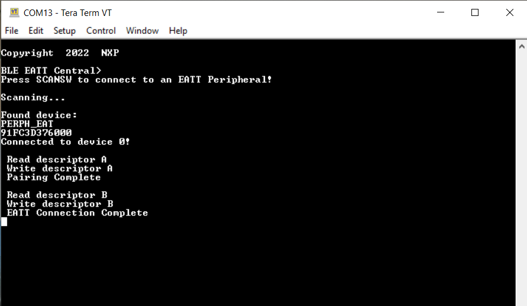
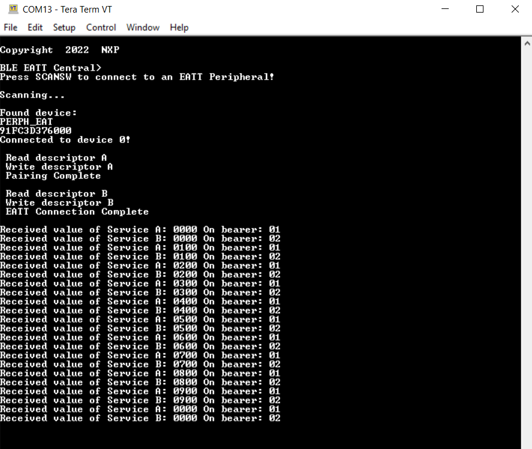

# Usage

The application can be tested using another board flashed with the EATT Central application as described in the [EATT Peripheral](eatt_peripheral.md).

1.  Open a serial port terminal and connect it to board, in the same manner described in [Testing devices](testing_devices.md). The start screen is displayed after the board is reset.
2.  To start scanning for devices, press the **SCANSW** button on the EATT Central board. To make it enter discoverable mode, perform the same step on the EATT Peripheral board. The host connects with the board after it sees it advertise the service A and service B UUIDs. After connecting, the central performs service discovery, indicates its EATT support to the server by writing the Client Supported Features characteristic, enables indications for services A and B, and then initiates an EATT connection with the server. See the figure below.

    **Output console on the EATT Central connected with an EATT Peripheral** 
    

3.  After the EATT connection is complete, the console displays the received data and the bearer on which it was sent, as shown in the figure below.

    **Output console on EATT Central**
    

**Parent topic:**[EATT Central](../topics/eatt_central.md)

