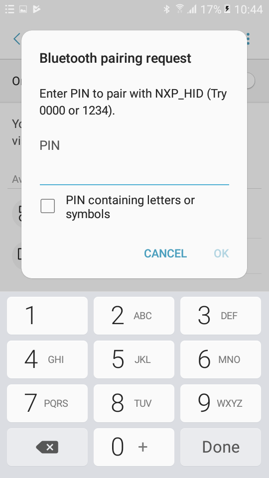
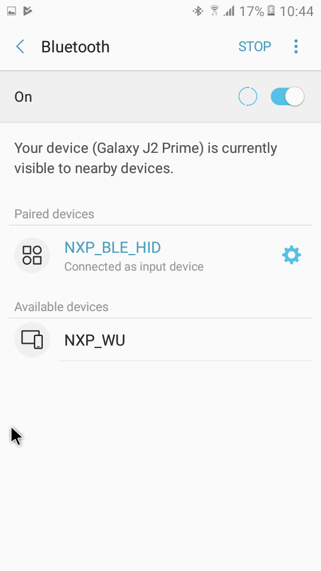

# Usage

The HID mouse can be connected to any Bluetooth Smart Ready products available on the market that supports HID devices or to another supported platform running the HID Host example \(setup steps detailed in the HID Host section\).

To make the HID mouse visible, press the **ADVSW** button to start sending advertisements, which causes CONNLED to start flashing. See the figure **Enter PIN prompt on Android platform** below.

The sensor name “NXP\_HID” shows on the device when its scanning is active. A solid CONNLED indicates a successful connection between the 2 devices. When prompted to enter the pin, type the 999999 passkey.

When configured, the HID mouse starts sending HID report, which is configured as explained above, with notifications every 100 milliseconds. The mouse cursor shows a square pattern movement on the screen as shown in the figure **HID Mouse detected by Android platform** below.

**Parent topic:**[HID Device \(Mouse\)](../topics/hid_device_mouse.md)

