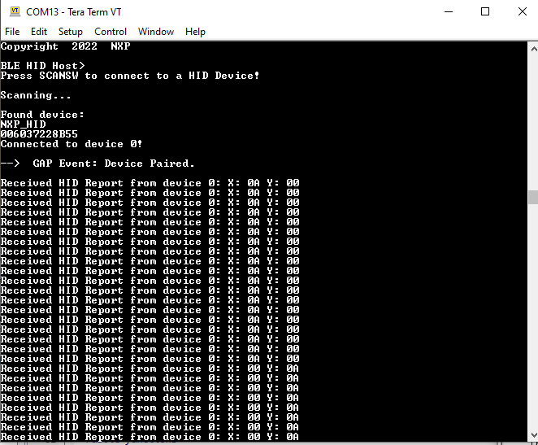

# Usage

The application is built to work only with the HID Device application presented in [HID Device \(Mouse\)](hid_device_mouse.md). It supports up to 2 peripherals connected at the same time.

1.  Open a serial port terminal and connect it to board, in the same manner described in [Testing devices](testing_devices.md). The start screen is displayed after the board is reset.
2.  To start scanning for devices, press the **SCANSW** button on the HID Host board. To make it enter discoverable mode, perform the same step on the HID device board. The host connects with the board after it sees it advertise the HID service, connects to it, and configures report notifications. The device then starts sending HID reports, as shown in [Figure](../images/hid_host.png).

    **HID host**
    

3.  To connect a second HID device, press again the **SCANSW** button on the HID Host board to start scanning for devices. Do the same on the second HID device board to make it enter discoverable mode. The host connects with the board after it sees it advertise the HID service, connects to it, and configures report notifications. The device then starts sending HID reports. The console displays reports from both devices, as shown in [Figure](../images/output_console_2_peripherals.png).

    **Tera Term – Output Console on HID Host with 2 peripherals connected**
    

**Parent topic:**[HID Host](../topics/hid_host.md)

