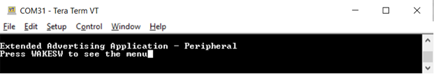
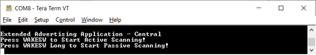
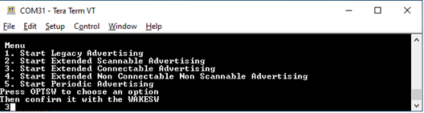
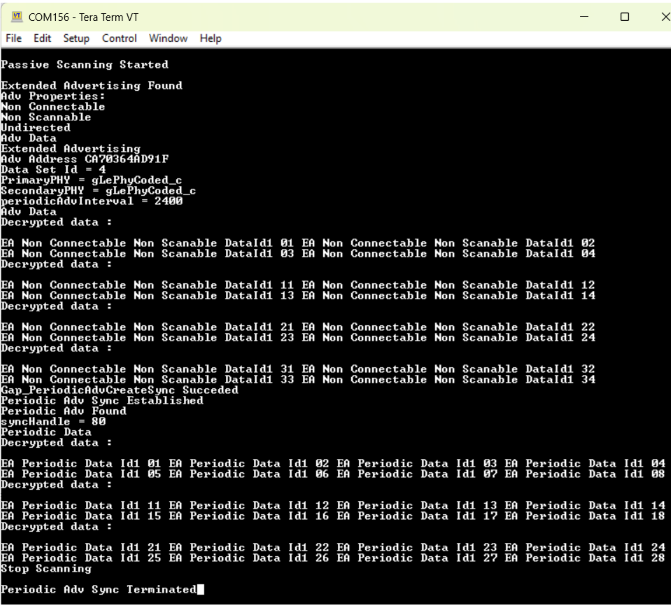
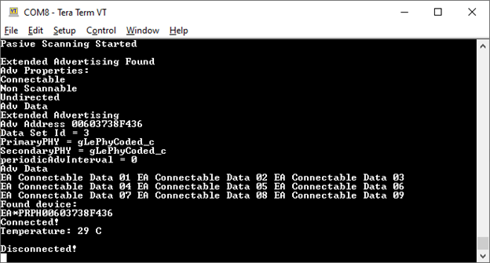

# Usage

The setup requires two supported platforms, one for the adv\_ext\_peripheral, and one for the adv\_ext\_central.

1.  Open a serial port terminal and connect it to each platform with the settings provided in the previous paragraph. The start screen is displayed after the boards are reset as shown in the figures below.

    **Advertizing external Peripheral start screen**
    


    **Advertizing external Central start screen**
    


2.  On the board that implements the adv\_ext\_peripheral application, press the **WAKESW** button. The board exits Deep-sleep mode and displays the menu as shown in the figure below.

    **Choosing a menu option on adv_ext_peripheral**
    

    Use the **OPTSW** to choose an option. The option printed on the bottom changes every time the switch is pressed. When the option matches your intention \(For example, 3 Starts Extended Connectable Advertising\), press the **WAKESW** again to make a decision. The advertising type chosen is started and the board starts entering low-power between advertising events.

    Next time, the **WAKESW** is pressed, an updated menu is printed \(For example, at option 3 Stop Extended Connectable Advertising\). There is no timeout for advertising. The board continues advertising until it is stopped, or a connection is established \(for legacy and extended connectable advertising only\) with an adv\_ext\_central device.

    The connection is terminated five seconds after the central device configures notifications for the temperature value. When all advertising is off and all connections are terminated, the board enters low-power mode until the **WAKESW** button is pressed again.

    When `gAppLowpowerEnabled_d` is set `0`, LEDs are enabled. The ADVLED flashes whenever an advertising starts and is ON otherwise. The CONNLED flashes whenever there is a connection under way and is ON otherwise.

    When PAWR is started , advertising data is transmitted on subevents zero and three and responses are expected on all 5 configured response slots of these subevents. The central application responds to the periodic data received with a six bytes data composed of a three bytes random number followed by a three bytes hash performed over the random number using the local IRK in the same fashion the RPA are generated. The advertiser prints the responses, uses the bonded devices IRKs to generate the hash over the random number and attempts to connect over PAWR with the responder in case the hashes match.

```
PAWR Started
PAWR Set Subevent Data Complete
Periodic advertising response received
Adv Handle: 0
Subevent: 0
Response slot: 2
Response data: EFBE6E573231
Periodic advertising response received
Adv Handle: 0
Subevent: 3
Response slot: 2
Response data: 021CED6395B8
PAWR Set Subevent Data Complete
```

3.  On the board that implements the **adv\_ext\_central** application, there are two options: Press **WAKESW** to start active scanning or long press **WAKESW** to start passive scanning. If catching extended scannable advertising is not an option, choose passive scanning. Otherwise, select active scanning. The device wakes up, starts scanning, and enters Deep-sleep mode. The scanning ends when the 60 seconds timeout is reached or when a connection with an adv\_ext\_peripheral device is established.

    During scanning, all advertisements caught from adv\_ext\_peripheral devices are displayed on the terminal window as shown in [Figure](../images/advetisings_caugth_on_adv_ext_central_console.png). When an extended non-connectable, non-scannable advertising with a periodic advertising attached is detected, the *adv\_ext\_central*device attempts to sync with the periodic advertising train and prints the periodic advertising data on the terminal window. When the 60 seconds timer expires or the connection ends, the device reenters Deep-sleep mode until the WAKESW is pressed again and all syncs with periodic advertising trains are terminated. If `gAppLowpowerEnabled_d` is set `0`, LEDs are enabled. The SCANLED flashes, whenever the device is scanning and is ON otherwise. The CONNLED flashes, whenever there is a connection under way and is ON otherwise. See the figure below

    **Advertising caught on adv_ext_central console**
    

    If the PAWR support is enabled and the periodic advertising train the adv_ext_central has synced to is with responses the application attempts to sync with the subevents zero and three, periodic advertising data printed being slightly different. Also, the application responds to the periodic data received with a six bytes data composed of a three bytes random number followed by a three bytes hash performed over the random number using the local IRK in the same fashion the RPA are generated. The advertiser uses the bonded devices IRKs to generate the hash over the random number and attempts to connect over PAWR with the responder in case the hashes match. 

```
Passive Scanning Started

Extended Advertising Found
Adv Properties:
Non Connectable
Non Scannable
Undirected
Adv Data
Extended Advertising
Adv Address C4603770BCC5
Data Set Id = 4
PrimaryPHY = gLePhyCoded_c
SecondaryPHY = gLePhyCoded_c
periodicAdvInterval = 2400
Adv Data
EA Non Connectable Non Scanable DataId1 01 EA Non Connectable Non Scanable DataId1 02
EA Non Connectable Non Scanable DataId1 03 EA Non Connectable Non Scanable DataId1 04
Gap_PeriodicAdvCreateSync Succeded
Periodic Adv Sync Established
Gap_SetPeriodicSyncSubevent Succeded
PAWR received
Sync Handle: 0050
Event Counter: 0007
Subevent: 0
Subevent data:
PAWR Data0 For Subevent 0
PAWR Data1 For Subevent 0
Gap_SetPeriodicAdvResponseData Succeded
Periodic Adv Set Response Data Complete
```

4.  If the **adv\_ext\_central** connects to an **adv\_ext\_peripheral** device, it bonds \(if no bond was previously made\), does service discovery \(only the first time it connects with the peripheral\), configures notification and waits for notifications from the peripheral. If no data is sent within 5 seconds, the node disconnects and reenters Deep-sleep mode. The peripheral sends a notification with the value of the temperature read through an ADC from a thermistor, if present, or randomly generated, if not. When the central receives the notification, it displays it on the terminal window and disconnects in 5 seconds as shown in the figure below

    **Connection on adv_ext_central console**
    

    When the PAWR support is enabled and a connection with a previously bonded device takes place over PAWR, the applications behavior is similar except in this case the adv_ext_central's role is peripheral and adv_ext_peripheral's role is central.

```
PAWR Started
PAWR Set Subevent Data Complete
Periodic advertising response received
Adv Handle: 0
Subevent: 3
Response slot: 2
Response data: 564DE1FC4957
 Gap_ConnectFromPawr Succeeded
Connected!

Disconnected!
```
```
PAWR received
Sync Handle: 0050
Event Counter: 0007
Subevent: 0
Subevent data:
PAWR Data0 For Subevent 0
PAWR Data1 For Subevent 0
Gap_SetPeriodicAdvResponseData Succeded
Periodic Adv Set Response Data Complete

Connected!
Temperature: 24 C

Disconnected!
```

**Parent topic:**[Low-power extended advertising Peripheral and Central](../topics/low-power_extended_advertising_peripheral_and_exte.md)

