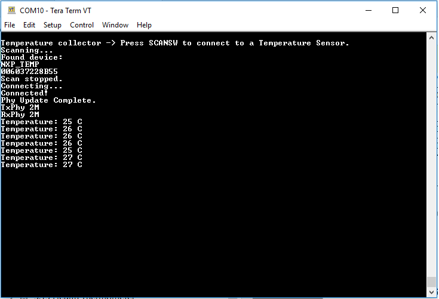

# Usage

The setup requires two supported platforms, one for the temperature sensor and one for the temperature collector.

1.  Open a serial port terminal and connect it to the temperature collector board, in the same manner as described in [Testing devices](testing_devices.md). The start screen is displayed after the board is reset. At first the LEDs are off on both devices.
2.  To start advertising on the sensor, press the WAKESW button and CONNLED lights up. The sensor enters into the Deep-sleep mode, which means that the MCU wakes up on any packet from the Link layer, in this case the connect request. If no connection is established in an interval of 30 seconds, the sensor stops advertising and enters into the Deep-sleep mode again. CONNLED turns off.
3.  To start scanning on the collector, press the WAKESW button and CONNLED lights up. The device wakes up, enters into the Deep-sleep mode, scans, and connects to a compatible sensor device. If no connection is established within 30 seconds, the collector stops scanning and enters Deep-sleep mode again. CONNLED turns off.
4.  If the collector connects to a sensor node, it bonds \(if no bond was previously made\), does service discovery \(only the first time it connects with the sensor\), and configures notification and waits for notifications from the sensor for 5 seconds. If no data is sent, the node disconnects and re-enters Deep-sleep mode. The sensor exits low power and sends a notification with the value of the temperature read through an ADC from the thermistor, if present, or random generated if not.

    Once the connection is established, the PHY is automatically updated to 2M, if both the sensor and the collector support this feature as shown in the figure below. The PHY update is configurable from the application.

    **Output Console on Temperature Collector**
    

5.  Subsequent key pressing triggers other notifications for the collector. If no key is pressed in an interval of 5 seconds, the sensor node disconnects and re-enters Deep-sleep mode.

**Parent topic:**[Low-power temperature sensor and collector](../topics/low-power_temperature_sensor_and_collector.md)

