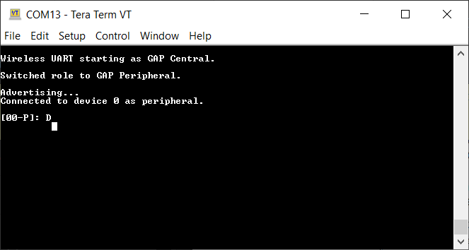

# Usage

The application is built to work with another supported platform running either Wireless UART or Wireless UART Host, or with the Wireless UART from the IoT Toolbox application.
### When testing with two boards, perform the following steps:

1.  Open a serial port terminal and connect to the two boards, in the same manner described in [Testing devices](testing_devices.md). The start screen is blank after the board is reset.
2.  The application starts as a GAP central. To switch the role to a GAP peripheral, press the role switch. Depending on the role, when pressing the **SCANSW**, the application starts either scanning or advertising.
3.  As soon as the **CONNLED** turns solid on both devices, the user can start writing in one of the consoles. The text appears on the other terminal.
4.  After creating a connection, the role \(central or peripheral\) is displayed on the console. The role switch can be pressed again before creating a new connection. See the figure below.

     **Tera Term – received text on Wireless UART**
     

### When testing with a single board and the IoT Toolbox, perform the following steps:

1.  Open a serial port terminal and connect the board in the same manner described in [Testing devices](testing_devices.md). The start screen is blank after the board is reset.
2.  Press the role switch button to behave as a GAP peripheral and then press the **SCANSW** button to start advertising. The IoT Toolbox app can then connect. Select UART instead of Console and start typing, as shown in the [Figure](../images/figure_27_new.PNG).

**Parent topic:**[Wireless UART Host](../topics/wireless_uart_host.md)

