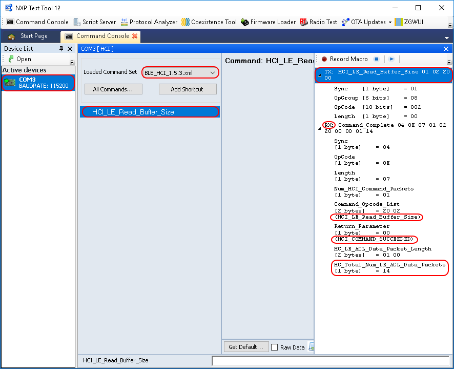

# Usage with Test Tool for Connectivity products

The Bluetooth LE HCI Black Box demo application is designed to be used via serial interface. This can be achieved using the TEST Tool for Connectivity Products – Command Console application as described below.

1.  Download the demo application to a supported board.
2.  Connect the board to a USB port of the PC. The UASB COM port drivers must be installed properly and a COM port corresponding to the board should be available.
3.  Open the Test Tool application and connect to the serial port corresponding to the board on which the Bluetooth LE HCI Black Box application runs. The serial communication parameters are: baud rate 115200, 8N1, and no flow control. See the figure **Test tool command console serial port selection** below.

    

4.  Select the appropriate Test Tool HCI XML file from the drop-down list for the release you are using. Send a few commands to the application. An example is shown in the figure **HCI black box command example** below.

    

**Parent topic:**[HCI Black Box](../topics/hci_black_box.md)

