# Usage with Over The Air Programming Tool

Below is a list of requirements for usage with Test Tool for Connectivity products:

-   Over The Air Programming Tool 1.4.0 or newer on [CONNECTIVITY-TOOL-SUITE](https://www.nxp.com/design/microcontrollers-developer-resources/connectivity-tool-suite:CONNECTIVITY-TOOL-SUITE#downloads)
-   Serial COM port drivers – these are board-specific.

To run the application, follow the steps below:

1.  Flash the OTAP Server onto a supported platform and the OTAP Client to another supported platform. Make sure the board running the OTAP Server is connected to your PC and your PC has appropriate drivers for the USB to serial device on that board.
2.  Create the application to send over the air. The executable must be provided in the `.srec` or `.bin` format. The `.srec` format executable can be obtained by using the IAR Output Converter and setting the output format to Motorola as shown in in the figure below. <br>

    When compiling an image for the Over-the-Air update, the `gEraseNVMLink_d` linker symbol must be set to `0` and `gUseSecureBoot_d` set to `1` only if you are using external storage support.

    In a specific use case, external storage support might be used and the image is created in MCUXpresso IDE. If this image is close to the maximum size of the internal storage, then a new flash section must be added before the NVM section. This step is necessary to ensure that the signature data does not overlap the NVM section. The flash section should be significant enough to accommodate the signature data.

    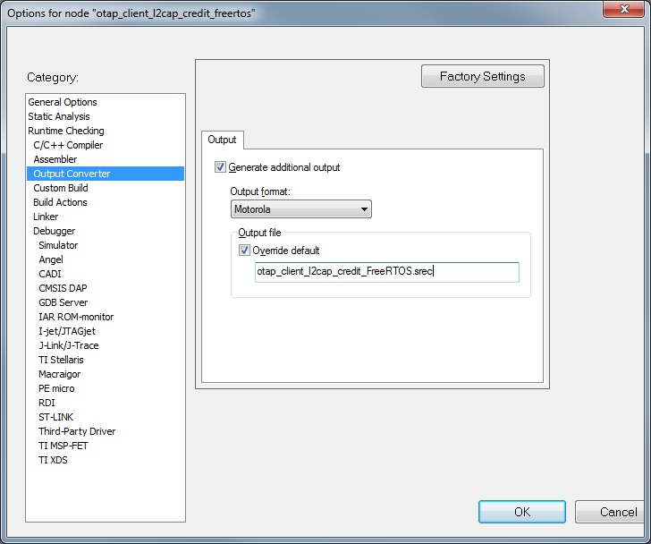

3.  To obtain a `.bin` file from IAR, select the **Raw binary** option in the **IAR Output Converter** as seen in the in the figure below. <br>

    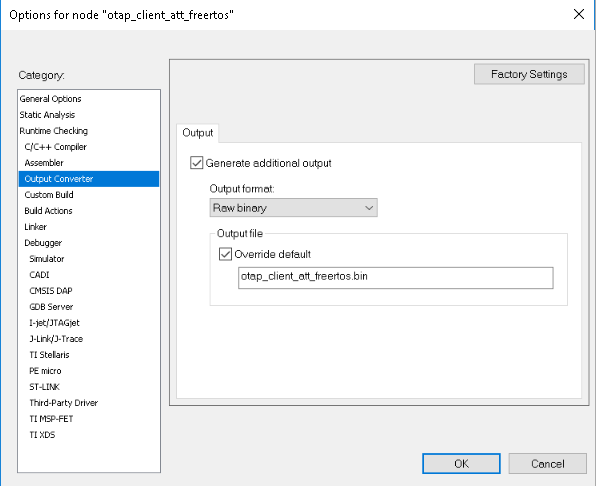

4.  To obtain a `.bin` file from MCUXpresso IDE, go to the **Project properties -\> Settings -\> Build steps**window and press the **Edit**button for the Post-build steps. A **Post-build steps** window shows up. In this window, add the following command:

    ```
    arm-none-eabi-objcopy -v -O binary  --only-section=.text
      --only-section=.data
     --only-section=.ARM.exidx "${BuildArtifactFileName}"
     "${BuildArtifactFileBaseName}.bin"
    ```

    In case the command already exists, uncomment it by removing the '\#' character at the beginning.

    To obtain a `.srec (.s19)` file, add or uncomment the following post-build command in the same window:

    ```
    arm-none-eabi-objcopy -v -O srec  --only-section=.text
      --only-section=.data --only-section=.ARM.exidx"
     ${BuildArtifactFileName}" "${BuildArtifactFileBaseName}.s19"
    ```

    This window is shown in the figure below. <br>

    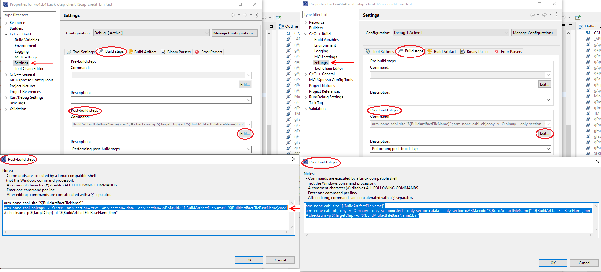

5.  Start the **Over The Air Programming** application and select "**OTAP Bluetooth LE**" from the "**Select OTA Protocol**" combo box as shown in the figure below. <br>

    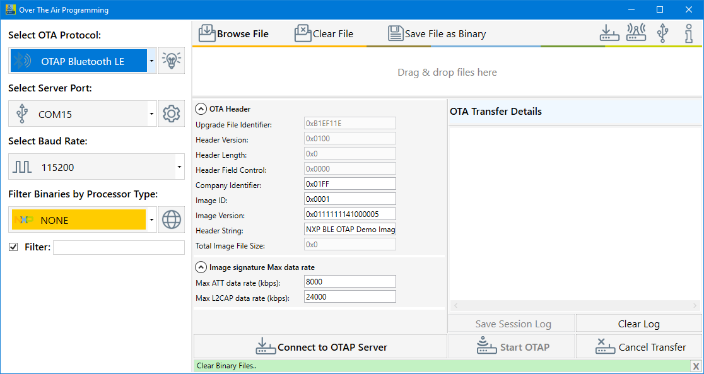

6.  **Load the image file into the application, then configure the image file header and start the OTAP Server:**
    -   To select the updated image In the Over the Air Programming tool, select the “**Browse File**” button and then navigate to the `.srec` or `.bin` file containing the image to be sent to the OTAP Client. After the `.srec` or `.bin` file is chosen, a pop-up window asks to choose the target processor. Choose the **KW45/K32W** processor and press **OK**. See the figure below. <br>

        

    -   Once the processor is selected, a new pop-up window would appear that allows selecting the type of image \(KW45Z/K32W1\(MCU\)\) as shown in the figure below. <br> \(In the specified case, we selected the KW45Z/KW45Z/K32W1\(MCU\).

        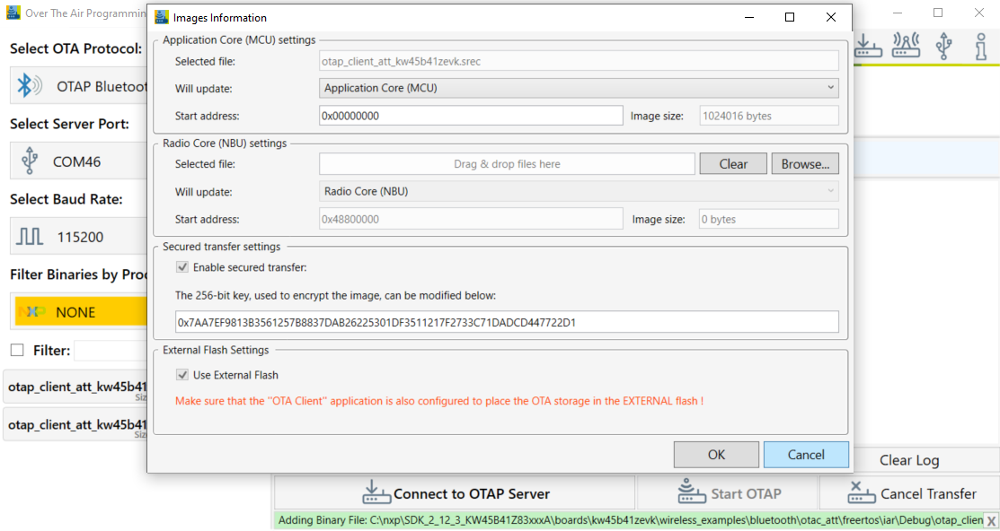

    -   To update the KW45B/KW32W1 \(radio\) image, select it by pressing the “**Browse**” button in the M3 group. Then navigate to the `.bin` file as shown in the figure below. <br>

        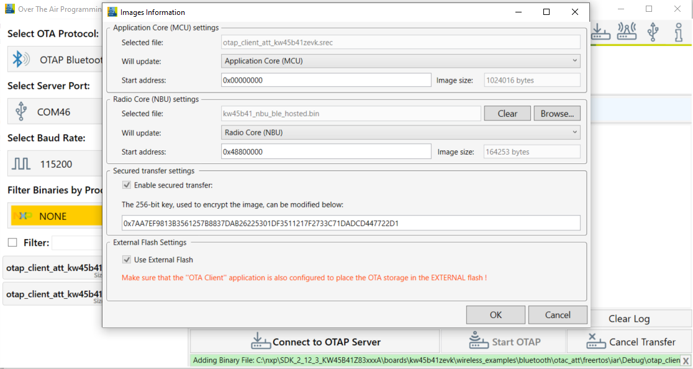

    -   If the OTA client has configured external memory support, then “**Use External Flash**” checkbox must be checked as in the figure below. If the OTA client has configured internal memory support, the checkbox must be left unchecked.

        This checkbox \(if checked\) instructs the OTA client bootloader to erase all the internal storage. This must be done only if external memory support is used as shown in the figure below. <br>.

        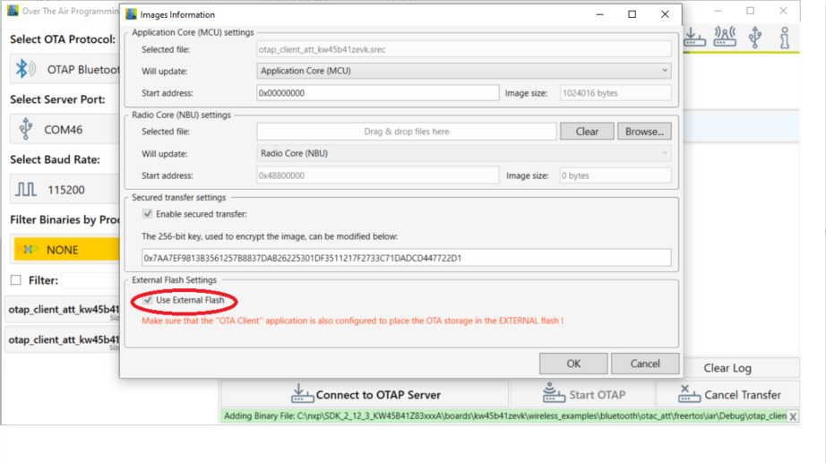

        At this moment, click the **OK**button. A new window appears that prompts you to enter a location where the secured file should be stored. By default, the location of the original file is selected. See the figure below. <br>

        **Note:** The extension of the secured file is \*.sb3. See the figure below.

        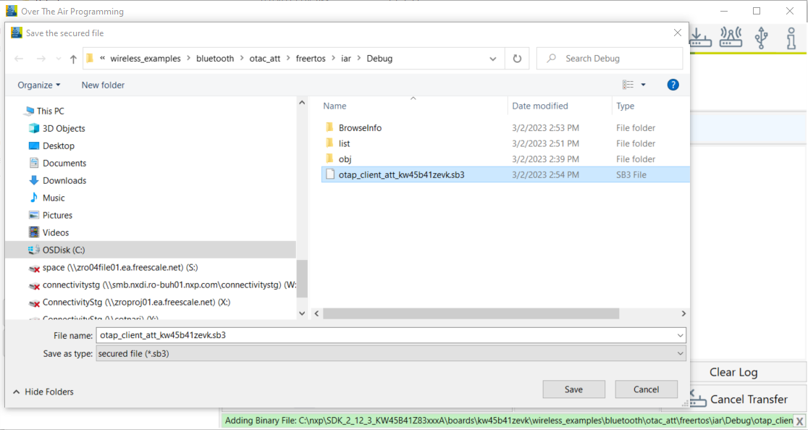

    -   You can now configure two different JSON files, used to:

        -   Sign the file that is uploaded to the MCU if an MCU file was selected.

        -   Create the *\*.sb3*container that is sent OTA. The *\*.sb3* file can contain only the MCU file, only the radio file, or both.

        If you select a file that is written on the MCU, a new window appears as shown in the figure below. This window helps in configuring the root certificates and signing the certificates, by either dragging and dropping, or browsing for new files. For details on each field of the JSON, see */Documentation/KW45JsonDescription.pdf* provided with Over the Air Programming tool.

        By default, the JSON is configured for the demo applications to run as shown in the figure below. <br>

        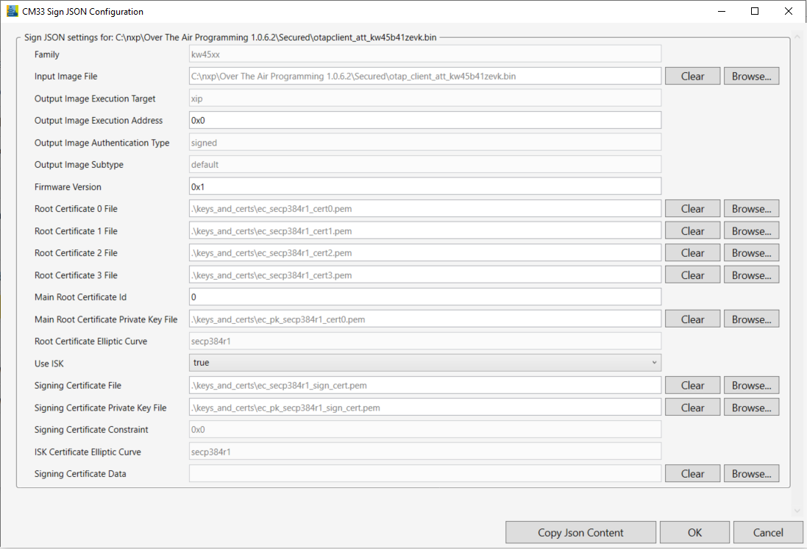

        After configuring the JSON file used for signing the MCU file, a new similar window appears. As shown in the [Figure 11](#fig_mmp_tpz_t5b), the window is designed for configuring the *\*.sb3* container. This window helps you to configure the encryption key file, the root certificates, and the signing certificates by either drag and dropping or browsing for new files. For details on each field of the JSON file, see */Documentation/KW45JsonDescription.pdf* provided with Over the Air Programming tool.

        By default, the JSON is configured for the demo applications to run as shown in the figure below. <br>

        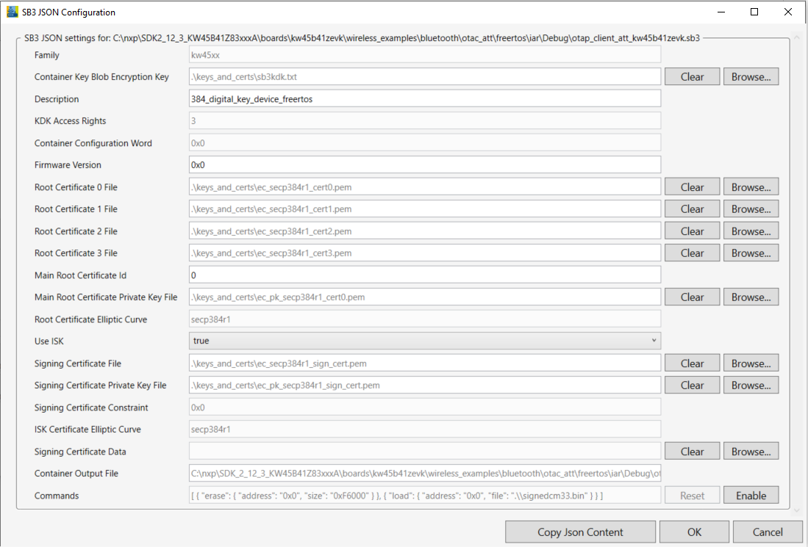

    -   After the `.sb3` file is created, the “**Encryption Key**” and “**Authentication Key**” are presented. For the secured update to be successful, the destination board must have been provisioned with these keys through fuse burning, as described in the accompanying document. Depending on the board type, it can either be already provisioned by NXP \(KW45B41Z-EVK / K32W148-EVK samples\) or not provisioned \(loosen samples\). See the figure below. <br>

        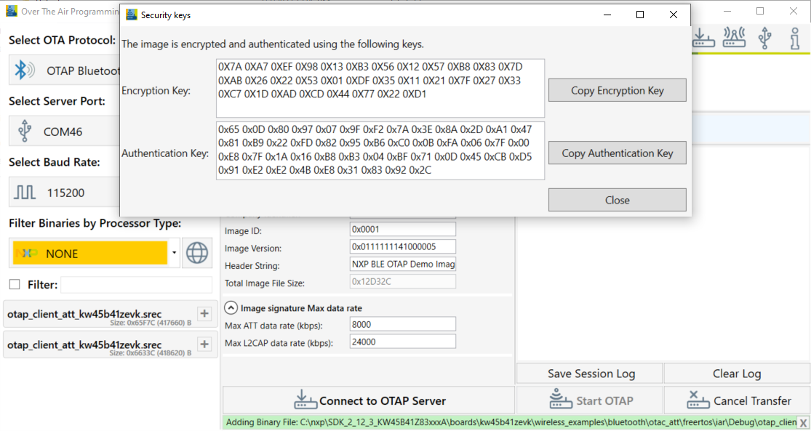

    -   The OTA Header configuration options from the “**OTA Header**” box are used by the application to build the **OTAP Image File**, which is sent over the air. The default values of the OTA Header configuration work out of the box for the OTAP demo applications. For details about these configuration options, see the *Bluetooth LE Application Developer’s Guide* document \(*BLEADG*\).
    -   After the image is loaded, go to the "**Select Server Port**" box, select the correct COM Port for the OTAP Server board. Also select the default baud rate of 115200 and press the “**Connect to OTAP Server**” button. A successful connection is displayed in the Message Log.

        -   If the image is loaded before connecting to the OATP Server COM Port, then the OTAP Server of the application starts automatically.
        -   If the connection to the COM Port is established before the image is loaded, then the “**Start OTAP**” button must be pressed to start the OTAP Server of the application. For details, see the figure below. <br>.
        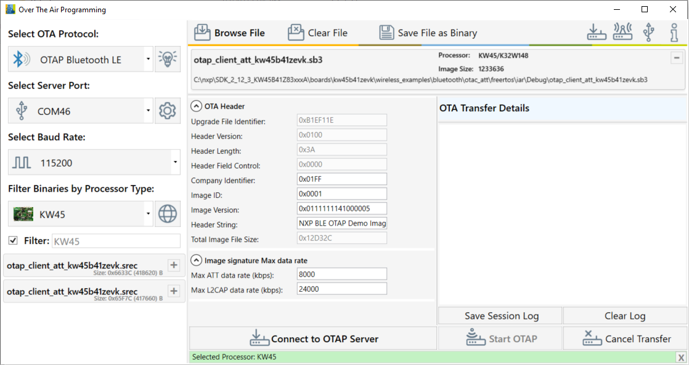

    -   Before starting the image transfer process, the data rate must be configured for each transfer method \(ATT or L2CAP CoC\). The image chunks of a block are sent over the serial interface and over-the-air without waiting for confirmation. Data rate can significantly slow down if configuration is not done correctly and errors appear in the transfer process.

        The optimal data rate depends on multiple factors. Some of these factors are listed below:

        -   Distance between boards
        -   Type of antenna
        -   Performance of the RF circuitry between the radio and antenna
        -   Type and level of noise in the environment
        -   Speed of the storage medium in which the image is saved on the OTAP Client
        -   Serial driver delay between PC and the OTAP Server board
        If the data rate is too high, then the OTAP Client receives a new chunk before it can process the previous one. In such a case, it sends an “**Unexpected Chunk Sequence Number**” error and restarts the transfer of the current block from where it left off. If the channel is too noisy, the transmitter can be flooded and some chunks might not reach the client triggering a similar type of error. The default data rate values should work for most configurations.

7.  Start the embedded applications by pressing **ADVSW** first on the OTAP Client and then on the OTAP Server. The transfer progress and transfer-related messages and/or errors are shown in the application window. The duration of the transfer depends on the size of the image and the chosen data rate and transfer method. See the figure below. <br>

    

8.  After all the blocks are sent, the OTAP Client sends an `Image Transfer Complete` command to the OTAP Server. When the PC Application receives this command, it displays a `Sent Image with Success` message in the log window. See the figure below. <br>
    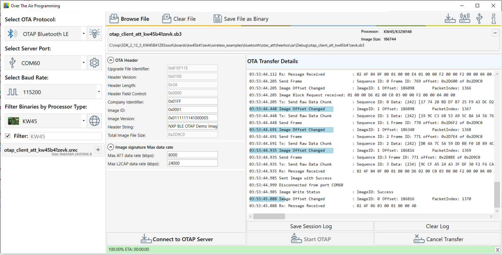

9.  After the image transfer is complete, the OTAP Client triggers the bootloader and resets the MCU. The bootloader takes about 30 seconds to flash the image on the board. After this time frame, the MCU resets again and runs the new image.

**Parent topic:**[Over the Air Programming \(OTAP\)](../topics/over_the_air_programming_otap.md)

