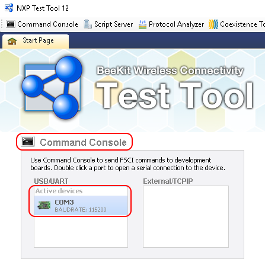
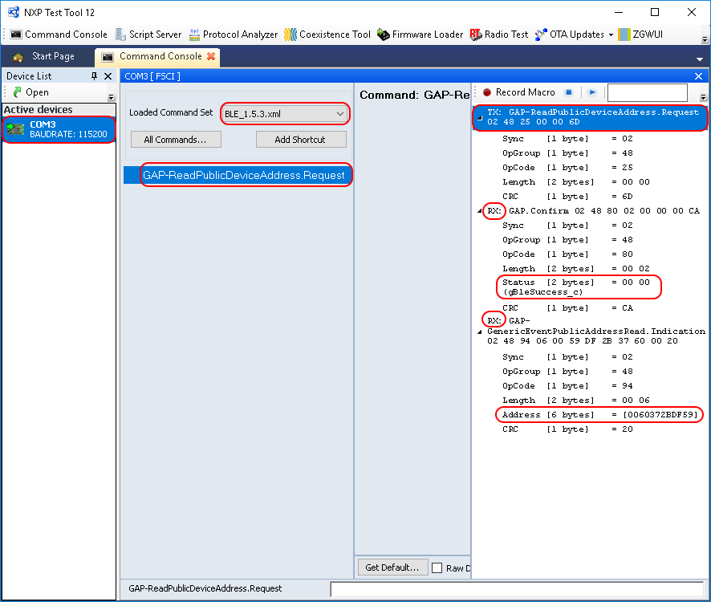

# Usage with Test Tool for connectivity products

The FSCI Bridge demo application is designed to be used via serial interface. This can be done using the TEST Tool for Connectivity Products – Command Console application as described below.

1.  Download the FSCI Bridge application onto a supported board's Application core, together with the NCP FSCI Black Box application on the NBU core.
2.  Connect the board to a USB port of the PC. The USB COM port drivers must be installed properly and a COM port corresponding to the board should be available.
3.  Open the Test Tool application and connect to the serial port corresponding to the board on which the FSCI Bridge application runs. See [Figure](../images/image_25_1.png). The serial communication parameters are: baud rate 115200, 8N1, and no flow control.

    

4.  Select the appropriate Test Tool XML file from the drop-down list for the release being used and send commands to the application. An example is shown in [Figure](../images/image_25_2.png).

    

**Parent topic:**[FSCI Bridge](../topics/fsci_bridge.md)

