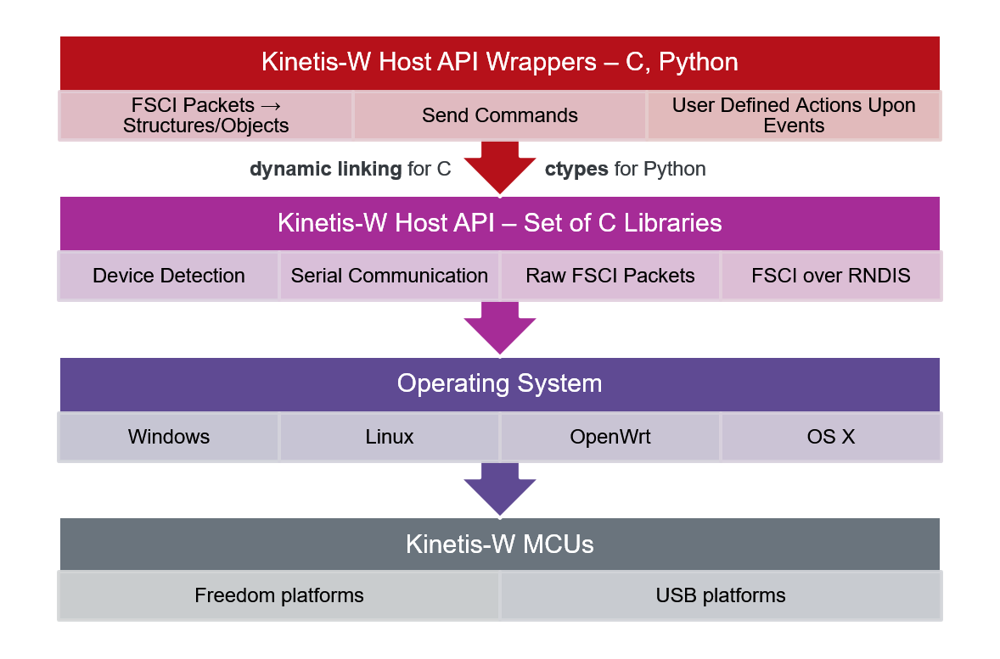

# Host Software Overview


The FSCI (Framework Serial Communication Interface) module allows interfacing the protocol stack with a host system or PC tool using a serial communication interface. 

FSCI can be demonstrated using various host software, one being the set of Linux OS libraries exposing the Host API described in this document. The NXP Test Tool for Connectivity Products PC application is another interfacing tool, running on the Windows OS. Bluetooth LE stack makes use of XML files which contain detailed meta-descriptors for commands and events transported over the FSCI.

The FSCI module is explained in the [_Wireless Framework - Services - FSCI_](../../../../framework/services/FSCI/README.md) documentation.


## Wireless host software system block diagram




## Directory tree

```
host_sdk
├── hsdk
│   ├── demo                                    A set of programs to demonstrate functionality.
│   │   ├── FSCIBootloader.c
│   │   ├── GetKinetisDevices.c                 Outputs all Kinetis devices available on serial to the console.
│   │   ├── Makefile
│   │   ├── bin                                 Folder containing libraries ".so".
│   ├── doc                                     Folder containing documentation.
│   ├── include                                 All the headers used are present in this folder.
│   │   ├── physical                            Headers specific to the physical serial bus or PCAP interface used by the NXP device.
│   │   │   ├── PhysicalDevice.h
│   │   │   ├── PCAP
│   │   │   │   └── PCAPDevice.h
│   │   │   ├── SPI
│   │   │   │   ├── SPIConfiguration.h          Handles SPI slave bus configuration(max speed Hz, bits per word).
│   │   │   │   └── SPIDevice.h                 Encapsulates an OS SPI device node into a well-defined structure.
│   │   │   └── UART
│   │   │       ├── UARTConfiguration.h         Handles serial port configuration (baudrate, parity).
│   │   │       ├── UARTDevice.h                Encapsulates an OS UART device node into a well-defined structure.
│   │   │       └── UARTDiscovery.h             Handles the discovery of UART connected devices.
│   │   ├── protocol                            Headers specific to the transmission of frames.
│   │   │   ├── Framer.h                        A state machine implementation for sending/ receiving frames.
│   │   │   └── FSCI                            Headers specific to the FSCI protocol.
│   │   │       ├── FSCIFrame.h
│   │   │       └── FSCIFramer.h
│   │   └── sys                                 General purpose headers for interaction with the OS, message queues and more.
│   │       ├── EventManager.h                  Handles event registering, notifying and callback submission.
│   │       ├── hsdkError.h                     Macros for error reporting.
│   │       ├── hsdkLogger.h                    Logger implementation for debugging.
│   │       ├── hsdkOSCommon.h                  Interaction with OS specifics.
│   │       ├── MessageQueue.h                  A standard message queue implementation (linked list).
│   │       ├── RawFrame.h                      Describes the format of a frame, independent of the protocol.
│   │       └── utils.h                         Various functions to manipulate structures and byte arrays.
│   ├── physical                                Implementation of the physical UART/SPI serial bus or PCAP interface module.
│   │   ├── PCAP
│   │   │   └── PCAPDevice.c
│   │   ├── PhysicalDevice.c
│   │   ├── SPI
│   │   │   ├── SPIConfiguration.c
│   │   │   └── SPIDevice.c
│   │   └── UART
│   │       ├── UARTConfiguration.c
│   │       ├── UARTDevice.c
│   │       └── UARTDiscovery.c
│   ├── protocol                                Implementation of the protocol module relating to FSCI.
│   │   ├── Framer.c
│   │   └── FSCI
│   │       ├── FSCIFrame.c
│   │       └── FSCIFramer.c
│   ├── res
│   │   ├── 77-mm-usb-device-blacklist.rules    Udev rules for disabling ModemManager.
│   │   └── hsdk.conf                           Configuration file to control FSCI-ACKs.
│   └── sys                                     Implementation of the system/OS portable base module.
│   │   ├── EventManager.c
│   │   ├── hsdkEvent.c
│   │   ├── hsdkFile.c
│   │   ├── hsdkLock.c
│   │   ├── hsdkLogger.c
│   │   ├── hsdkSemaphore.c
│   │   ├── hsdkThread.c
│   │   ├── MessageQueue.c
│   │   ├── RawFrame.c
│   │   └── utils.c
│   ├── ConnectivityLibrary.sln                 Microsoft Visual Studio solution file.
│   ├── HSDK.rc
│   ├── Makefile
│   ├── README.md
│   ├── resource.h
├── hsdk-c                                      Described in Host API C Bindings
├── hsdk-python                                 Described in Host API Python Bindings
└── README.txt
```


## Device detection

The Wireless Host SDK can detect every USB attached peripheral device to a PC. On Linux OS, this is done via udev. Udev is the device manager for the Linux OS kernel and was introduced in Linux OS 2.5. Using the manager, the Wireless Host API can provide the Linux OS path for a device (for example, `/dev/ttyACM0`) and whether the device is a supported USB device, based on the vendor ID/product ID advertised. Upon device insertion, the USB `cdc_acm` kernel module is triggered by the kernel for interaction with TWR, USB and FRDM devices.

On Windows OS, attached peripherals are retrieved from the registry path `HKEY_LOCAL_MACHINE\HARDWARE\DEVICEMAP\SERIALCOMM`, resulting in names such as _COMxx_ which must be used as input strings for the Python scripts which require a device name.


## Serial port configuration

The Host SDK configures a serial UART port with the following default values:

**Host SDK – UART default values**

| Configuration    | Value       |
| ---------------- | ----------- |
| Baudrate         | 115200      |
| ByteSize         | EIGHTBITS   |
| StopBits         | ONE_STOPBIT |
| PARITY           | NO_PARITY   |
| HandleDSRControl | 0           |
| HandleDTRControl | ENABLEDTR   |
| HandleRTSControl | ENABLERTS   |
| InX              | 0           |
| OutCtsFlow       | 1           |
| OutDSRFlow       | 1           |
| OutX             | 0           |

The library only allows the possibility to change the baudrate, as this is the most common scenario.

> **NOTE**: For devices using a USB connection interfaced directly (where the USB stack runs on the device and the system is NOT using an OpenSDA UART to USB converter), the baudrate is not necessary and setting it has no effect.

The Host SDK configures a serial SPI port with the following default values:

**Host SDK – SPI default values**

| Configuration                   | Value           |
| ------------------------------- | --------------- |
| Transfer Mode                   | Mode SPI_MODE_0 |
| Maximum SPI transfer speed (Hz) | 1 MHz           |
| Bits per word                   | 8               |

The library only allows the possibility to change the maximum SPI transfer speed.


## Logger

The Host SDK implements a logger functionality which is useful for debugging. Adding the compiler flag USE_LOGGER enables this functionality.

When running programs that make use of the Host SDK, a file named hsdk.log appears in the working directory. This is an excerpt from the log:

    HSDK_INFO - [6684] [PhysicalDevice]InitPhysicalDevice:Allocated memory for PhysicalDevice
    HSDK_INFO - [6684] [PhysicalDevice]InitPhysicalDevice:Initialized device's message queue
    HSDK_INFO - [6684] [PhysicalDevice]InitPhysicalDevice:Created event manager for device
    HSDK_INFO - [6684] [PhysicalDevice]InitPhysicalDevice:Created threadStart event
    HSDK_INFO - [6684] [PhysicalDevice]InitPhysicalDevice:Created stopThread event
    HSDK_INFO - [6684] [PhysicalDevice]AttachToConcreteImplementation:Attached to a concrete implementation
    HSDK_INFO - [6684] [PhysicalDevice]InitPhysicalDevice:Created and start device thread
    HSDK_INFO - [6684] [Framer]InitializeFramer:Allocated memory for Framer
    HSDK_INFO - [6684] [Framer]InitializeFramer:Created stopThread event
    HSDK_INFO - [6684] [Framer]InitializeFramer:Initialized framer's message queue
    HSDK_INFO - [6684] [Framer]InitializeFramer:Created event manager for framer


**Parent topic:** [Bluetooth Low Energy Host Stack FSCI Application Programming](../Bluetooth%20Low%20Energy%20Host%20Stack%20FSCI%20Application%20Programming.md)
