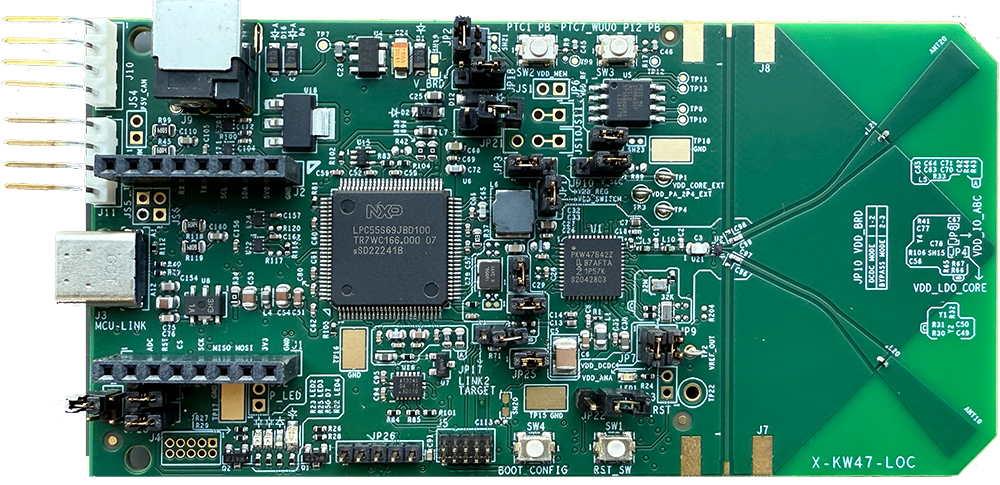
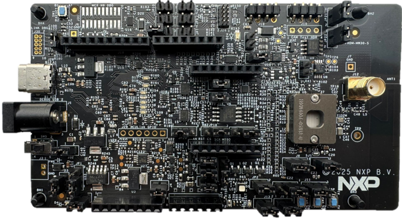

(examples__wireless_examples__bluetooth__loc_reader_platforms_docs)=
# Bluetooth Low Energy Localization Hardware Platforms

The Bluetooth Low Energy Localization demo applications support the following platforms that have Bluetooth Low Energy transceiver capabilities:

-   KW47-EVK \(see [Figure 1](../images/MCX-W72/KW47_EVK.png)\)
-   KW47-LOC \(see [Figure 2](../images/MCX-W72/KW47_LOC.png)\)
-   MCXW72-EVK \(see [Figure 3](../images/MCX-W72/MCX_W72_EVK.png)\)
-   FRDM-MCXW72 \(see [Figure 4](../images/MCX-W72/FRDM_MCXW72.png)\)
-   MCXW72-LOC \(see [Figure 5](../images/MCX-W72/MCXW72_LOC.png)\)
-   FRDM-KW43 \(see [Figure 6](../images/MCX-W72/FRDM-KW43.png)\)

**Note**: The KW47/MCXW72/KW43 device family includes the LCE (Localization Compute Engine). This is a hardware accelerator for the localization algorithm.

