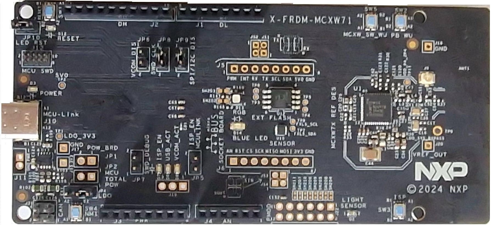

# Bluetooth Low Energy Localization Hardware Platforms

The Bluetooth Low Energy Localization demo applications support the following platforms that have Bluetooth Low Energy transceiver capabilities:

-   K32W148-EVK \(see [Figure 1](../images/K32W148-EVK-IMG.svg)\)\)
-   KW45B41Z-EVK \(see [Figure 2](../images/KW45B41Z-EVK-IMG.svg)\)
-   KW45B41Z-LOC \(see [Figure 3](../images/KW45B41Z-LOC-TOP-IMG.svg)\)
-   FRDM-MCXW71 \(see [Figure 4](../images/FRDM-MCXW71.svg)\)

The Bluetooth Low Energy Localization demo applications also support these boards:

-   KW47-EVK \(see [Figure 5](../images/MCX-W72/KW47_EVK.png)\)
-   KW47-LOC \(see [Figure 6](../images/MCX-W72/KW47_LOC.png)\)
-   MCXW72-EVK \(see [Figure 7](../images/MCX-W72/MCX_W72_EVK.png)\)
-   FRDM-MCXW72 \(see [Figure 8](../images/MCX-W72/FRDM_MCXW72.png)\)

**Note**: The KW47/MCXW72 device family includes the LCE (Localization Compute Engine). This is a hardware accelerator for the localization algorithm. If using a non-LCE phantom refer to [Disabling LCE for non-LCE Phantoms](disabling_lce.md) for toolchain-specific instructions on how to disable the LCE support from the SDK examples.

  

