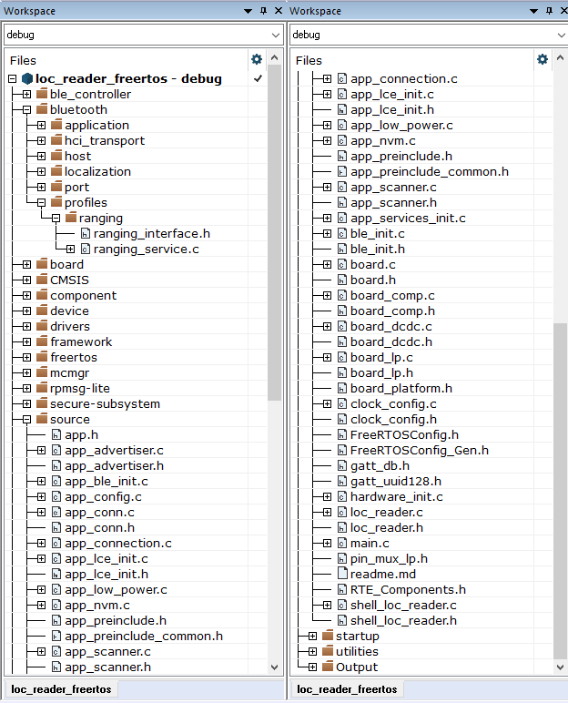

# Deploying Bluetooth Low Energy Localization Applications Software

The software package includes the components necessary for Bluetooth Low Energy localization application development on the selected NXP platform. These components include:

-   Bluetooth Low Energy Host software libraries
-   NBU image binaries
-   Channel Sounding and Localization Algorithm libraries
-   Examples of sample application project corresponding to Channel Sounding roles, Initiator \(Localization User Device\), and Reflector \(Localization Reader\) roles
-   Platform peripheral drivers, platform startup code, other generic platform software

**Note:** Prior to loading any wireless SDK example, update your NBU image with the provided binaries, with channel sounding support, in the following folder of the SDK: `../middleware/wireless/ble-controller/bin`.

The demo applications were compiled and tested with **IAR Embedded Workbench** for Arm and **ARMGCC**. Use one of these tools to deploy your sample application.

To open, build, and run any sample application, see the *Bluetooth Low Energy Quick Start Guide* document of the corresponding board. The Bluetooth Low Energy Localization examples are built and run in the same manner as the Bluetooth Low Energy examples.

[Figure 1](../images/Fig5_app_struct.png) shows the application folder structure for the `loc_reader` project for the zip package. The relevant files for Bluetooth Low Energy localization are the following:

-   The main application source files are `source/loc_reader.c` and `source/shell_loc_reader.c`.
-   The files in `bluetooth/profiles/ranging` implement the Ranging Service.
-   The files in `source` folder contain the Bluetooth Low Energy localization application common code and localization algorithm implementation.

