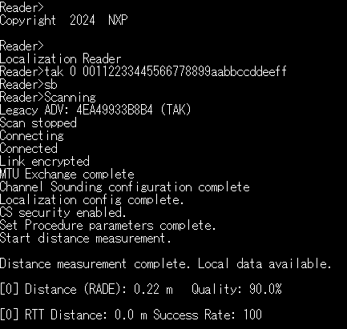
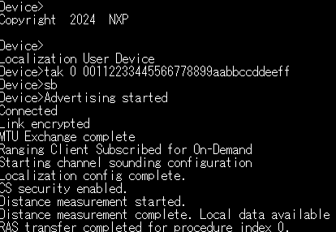

# Transient Application Key (TAK)

## Overview
The Transient Application Key (TAK) feature provides enhanced security for Bluetooth LE connections between the Localization Reader and Device applications. TAK is a one-time use symmetric key that must be pre-shared between devices before establishing a connection. Once used, the key is automatically erased per specification requirements. This guide provides out-of-the-box commands ready for copy-paste into TeraTerm.

## Prerequisites
Ensure both applications are compiled with TAK enabled (`gAppUseTAK_c = 1`) and `gAppTAKAdvID_c` matches on both sides. The default configuration supports up to 4 TAK entries (`gConnTakMaxEntries_c = 4`). 
In order for Peripheral to allow passing LTK request (coming from an unbonded device) to the application, `gBleHostAutoRejectLtkRequestForUnbondedDevices_c` must be set to `FALSE` in the loc_user_device application.
Because TAK is not considered sufficient method for an attribute which requires encryption, all encryption-related flags from the database must be removed. 
Check gatt_db.h, on the loc_user_device and remove the flags `gPermissionFlagWriteWithEncryption_c` and `gPermissionFlagReadWithEncryption_c`.

## Quick Setup
### Setup on Localization Reader
`tak 0 00112233445566778899aabbccddeeff` 
`sb`

### Setup on Localization Device
`tak 0 00112233445566778899aabbccddeeff` 
`sb`

### For Subsequent Connections
Since TAK is erased after use, set a new key before the next connection:
`tak 0 112233445566778899aabbccddeeff00`

## Typical Console Output

