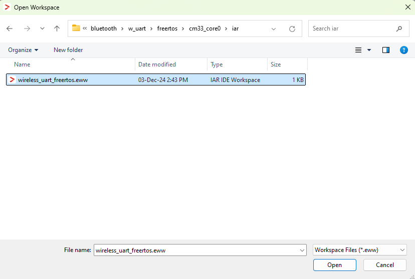
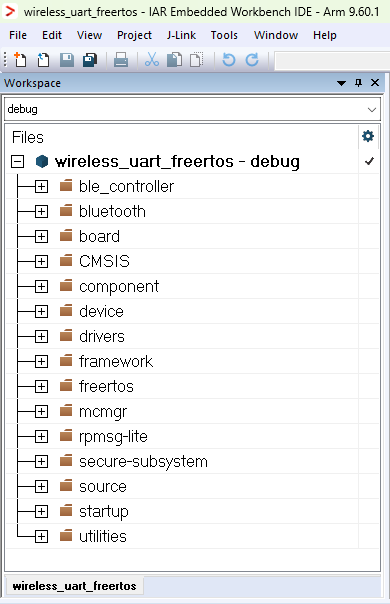
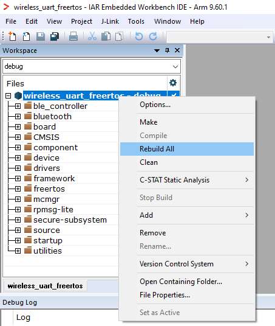
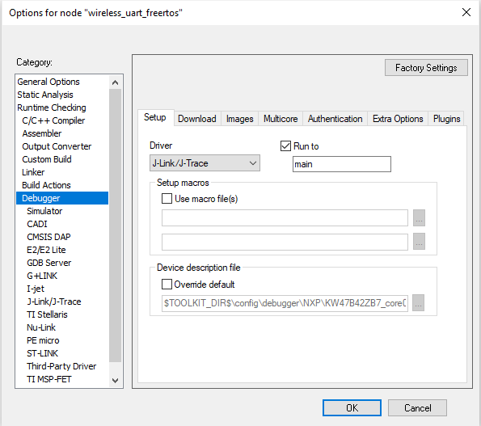
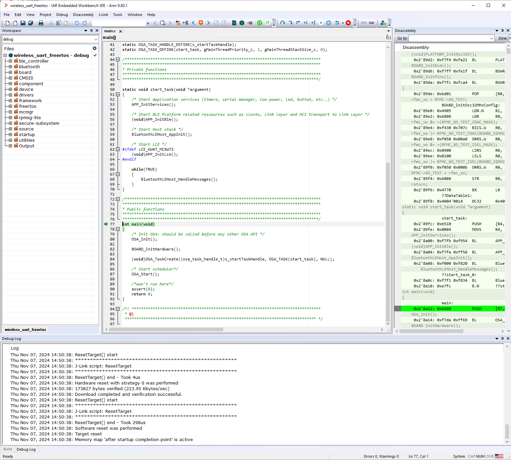

# Building and flashing the BLE software demo applications using IAR Embedded Workbench

Use the following steps in order to build and flash the BLE software demo applications using the IAR Embedded Workbench:

1.  First unpack the contents of the archive to a folder on the local disk. Then, navigate to the resulting location starting from the SDK root directory.

2.  Open the IAR workspace file \(`*.eww` file format\) highlighted file in the figure below.

    **Wireless UART IAR demo project location**
    

3.  Choose between Debug and Release configurations in the drop-down selector above the project tree in the workspace.

    **Select the desired configuration (Debug or Release)**
    ")

    The figure below shows the Wireless UART - IAR workspace.

    **Wireless UART - IAR workspace**\
    

4.  Build the Wireless UART project using the options shown in the figure.

    **Build Wireless UART application**
    

5.  Make the appropriate debugger settings in the project options window, as seen in the next figure.

    Go to: **Project \> Options \(Alt+F7\) \> Debugger \> Setup \(tab\) \> Driver \> J-Link/J-Trace**

    **Debugger Settings for the Wireless UART project**
    

6.  Click the “**Download and Debug**” button \(or **CTRL+D**\) to flash the executable onto the board.

    **Download and Debug the Wireless UART application**
    

7.  Press **Go** \(**F5**\). At this moment, the board starts running the application.

    **Running the code on IAR**
    

**Parent topic:**[Building the binaries](../topics/building_the_binaries.md)

