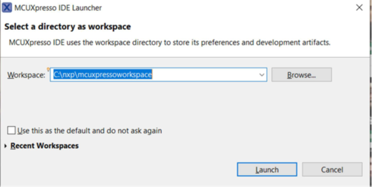
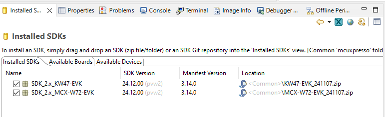
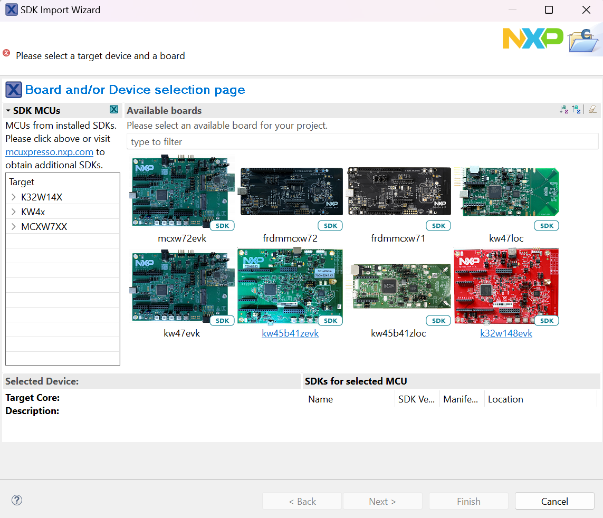
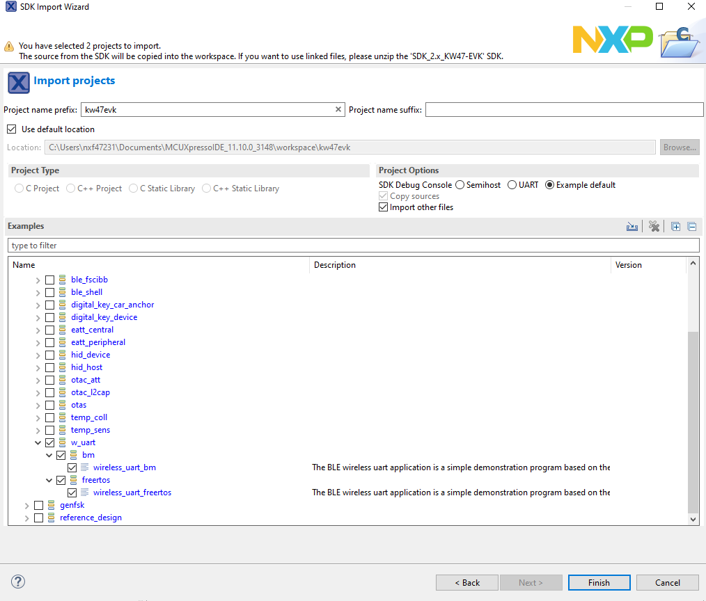
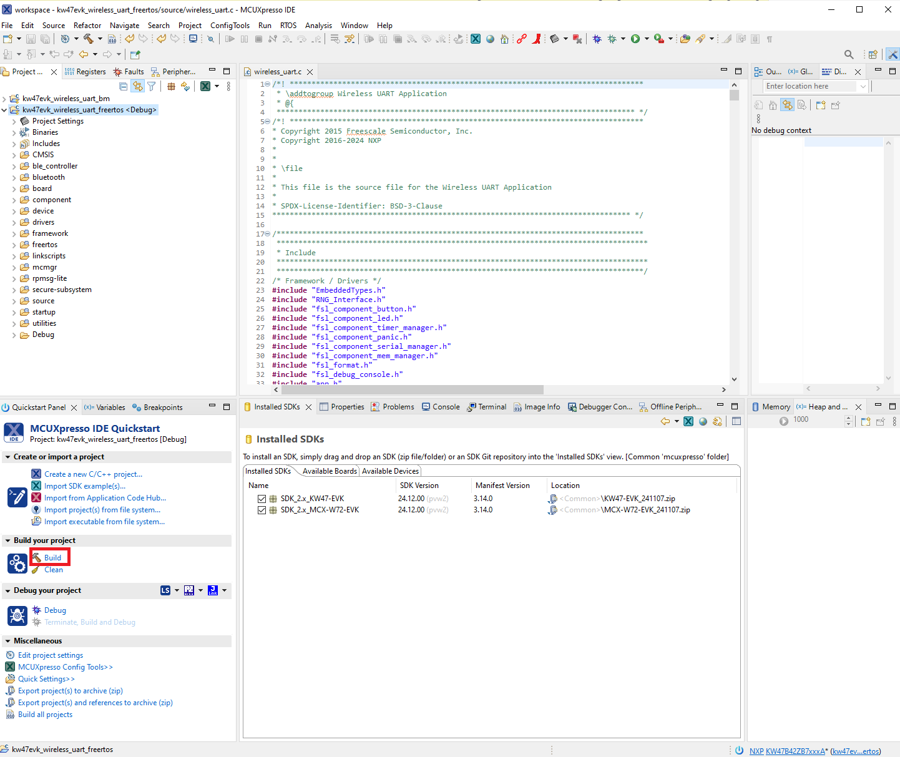
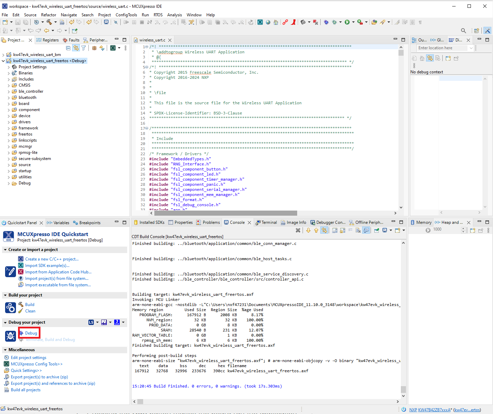
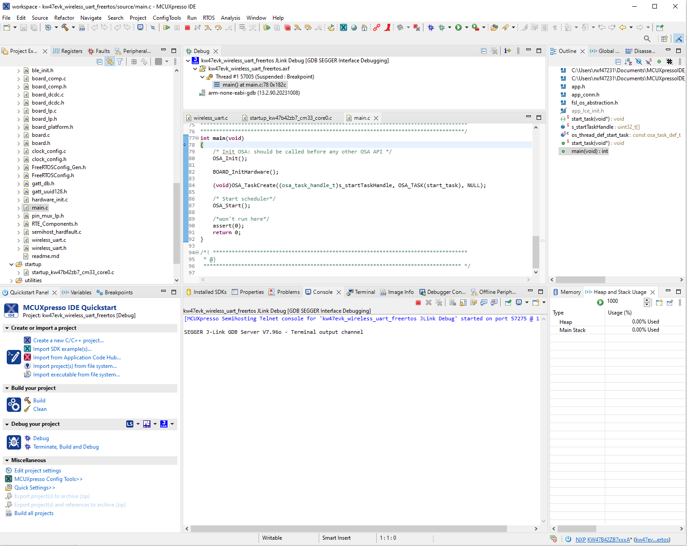

# Building and flashing the BLE Software Demo applications using MCUXpresso IDE

To build and flash the BLE software demo applications using MCUXpresso IDE, follow the steps listed below:

1.  Open MCUXpresso IDE and open an existing or new workspace location.

    **Select MCUXpresso IDE workspace**
    

2.  Drag and drop the package archive into the **MCUXpresso Installed SDKs** area in the lower right of the main window.

    **Installed SDKs in MCUXpresso IDE workspace**
    

3.  After the SDK is loaded successfully, select the “**Import the SDK examples\(s\)…**” to add examples to your workspace.

    **Importing SDK example(s)**
    ")

4.  To select the desired example\(s\), select the *kw45b41zevk / kw45b41zloc / k32w148evk / kw47evk / frdmmcxw71 / frdmmcxw72 / mcxw72evk / kw47loc* board and then click the “**Next**” button:

    **Selecting the KW47-EVK board**
    

    **Select Wireless UART FreeRTOS project**
    

5.  Build the `wireless_uart_freertos` project.

    **Build the Wireless UART FreeRTOS project**
    

6.  Click the “**Debug**” button to download the executable onto the board. Make sure you select the appropriate device to flash.

    **Download and debug the Wireless UART FreeRTOS project**
    

7.  Pressing the **Run** button makes the board run the application.

    **Running the code on MCUXpresso IDE**
    

**Parent topic:**[Building the binaries](../topics/building_the_binaries.md)

