# Building and flashing the BLE Extended NBU software demo applications using IAR Embedded Workbench

Use the following steps in order to build and flash the BLE software demo applications using the IAR Embedded Workbench:

1.  First unpack the contents of the archive to a folder on the local disk. Then, navigate to the resulting location starting from the SDK root directory.

2.  Open the IAR workspace file \(`*.eww` file format\) highlighted file in the figure below.

    **NCP FSCI Blackbox IAR demo project location**
    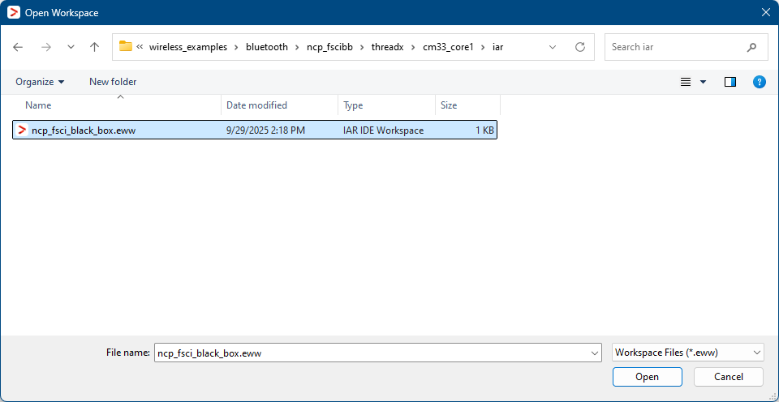

3.  Choose between Debug and Release configurations in the drop-down selector above the project tree in the workspace.

    **Select the desired configuration (Debug or Release)**
    ")

    The figure below shows the NCP FSCI Blackbox - IAR workspace.

    **NCP FSCI Blackbox - IAR workspace**\
    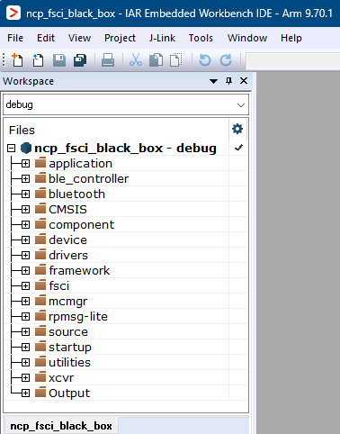

4.  Build the NCP FSCI Blackbox project using the options shown in the figure.

    **Build NCP FSCI Blackbox application**
    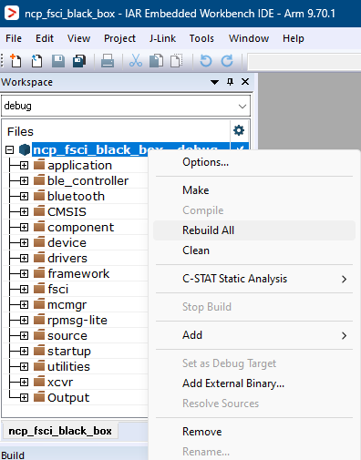

5.  Make the appropriate debugger settings in the project options window, as seen in the next figure.

    Go to: **Project \> Options \(Alt+F7\) \> Debugger \> Setup \(tab\) \> Driver \> J-Link/J-Trace**

    **Debugger Settings for the NCP FSCI Blackbox project**
    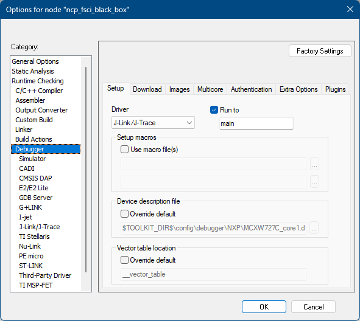

6.  Click the “**Download and Debug**” button \(or **CTRL+D**\) to flash the executable onto the board.

    **Download and Debug the NCP FSCI Blackbox application**
    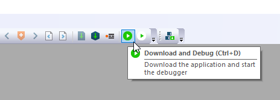

7.  Press **Go** \(**F5**\). At this moment, the board starts running the application.

    **Running the code on IAR**
    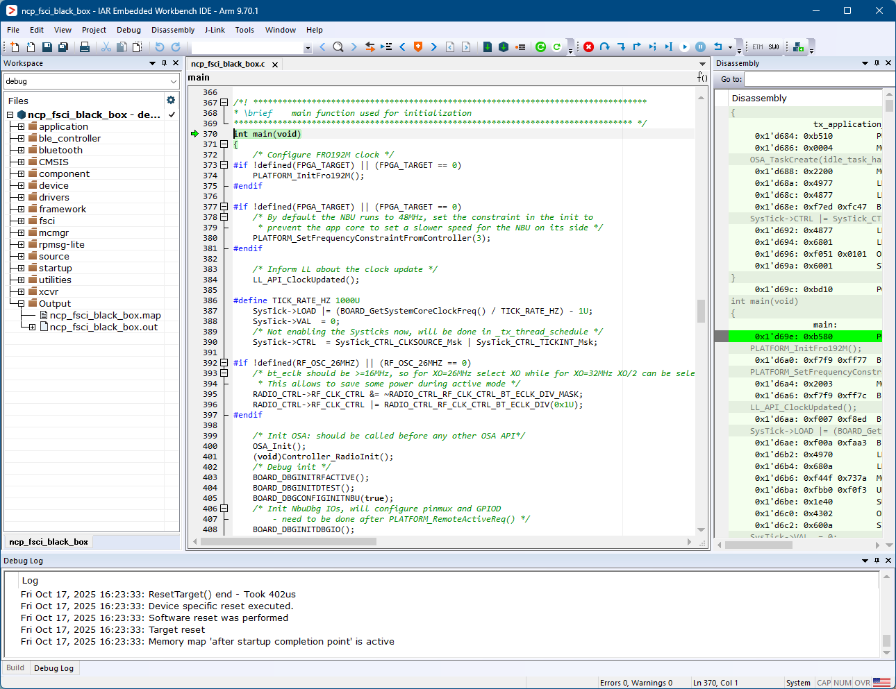

8.  Open the Core0 IAR workspace file \(`*.eww` file format\) highlighted file in the figure below.

    **Wireless UART Host IAR demo project location**
    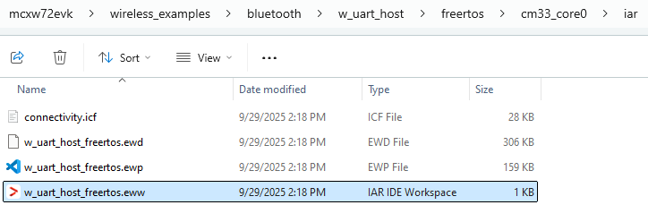

9.  Choose between Debug and Release configurations in the drop-down selector above the project tree in the workspace.

    **Select the desired configuration (Debug or Release)**
    ")

    The figure below shows the Wireless Uart Host - IAR workspace.

    **Wireless Uart Host - IAR workspace**\
    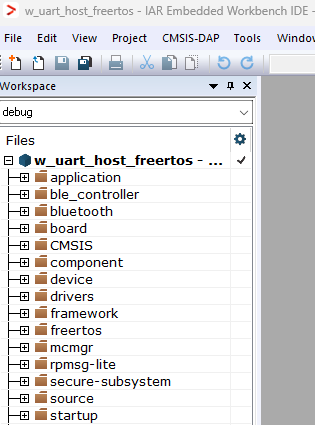

9.  Build the Wireless Uart Host project using the options shown in the figure.

    **Build Wireless Uart Host application**
    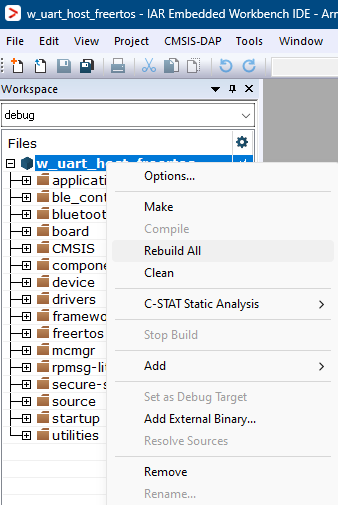

9.  Make the appropriate debugger settings in the project options window, as seen in the next figure.

    Go to: **Project \> Options \(Alt+F7\) \> Debugger \> Setup \(tab\) \> Driver \> J-Link/J-Trace**

    **Debugger Settings for the Wireless Uart Host project**
    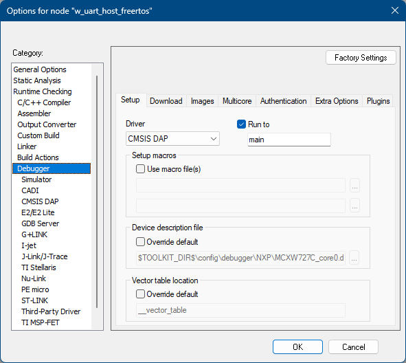

9.  Click the “**Download and Debug**” button \(or **CTRL+D**\) to flash the executable onto the board.

    **Download and Debug the Wireless Uart Host application**
    

9.  Press **Go** \(**F5**\). At this moment, the board starts running the application.

    **Running the code on IAR**
    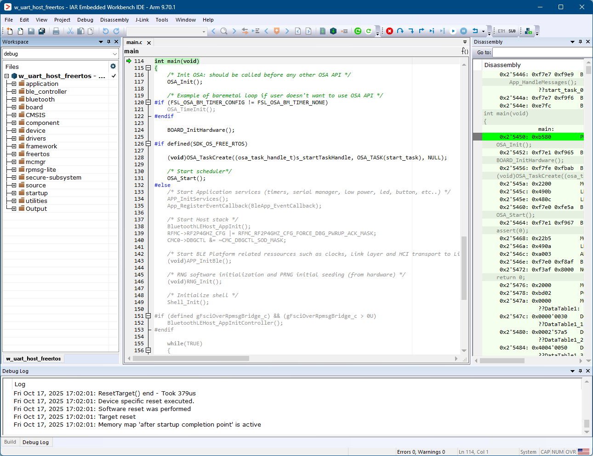

**Parent topic:**[Building the binaries](../topics/building_the_binaries.md)

