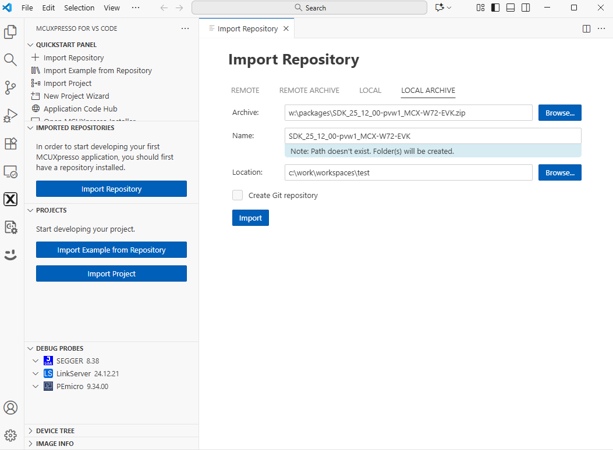
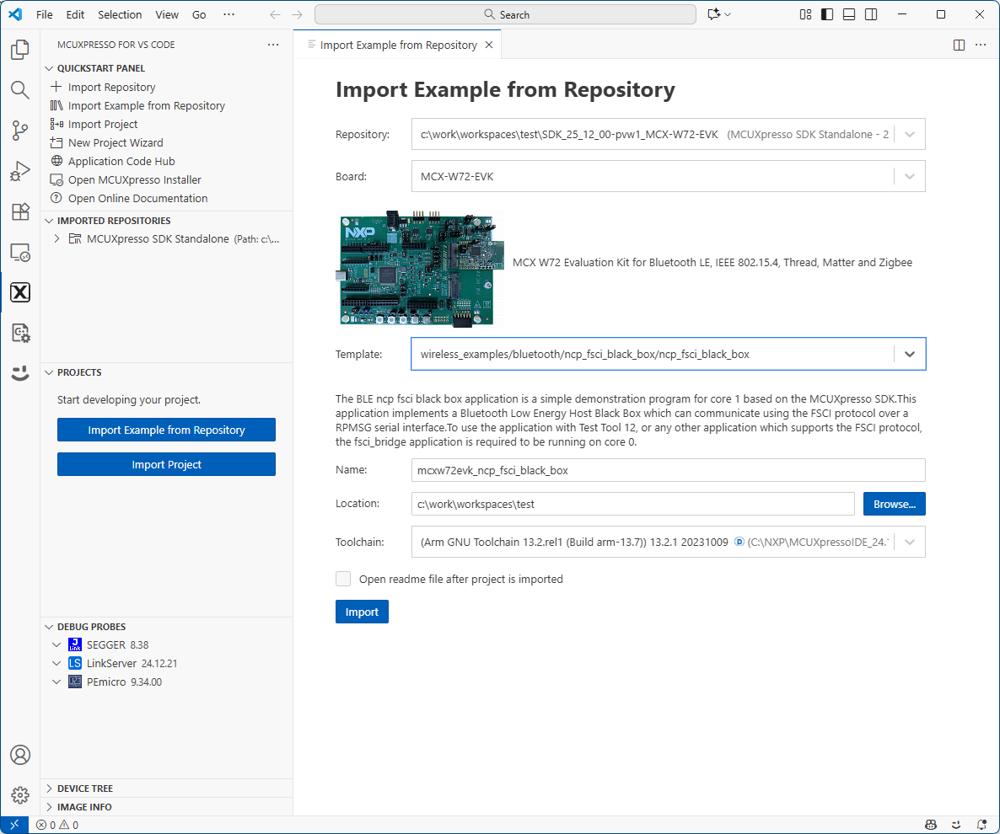
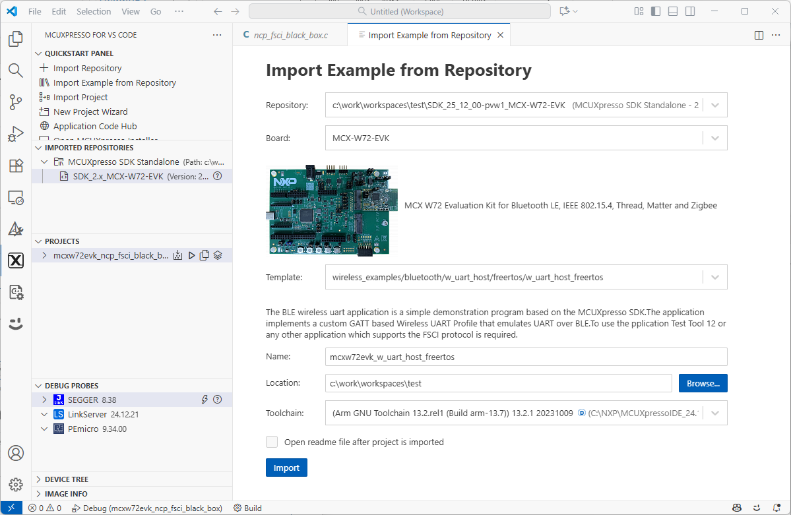
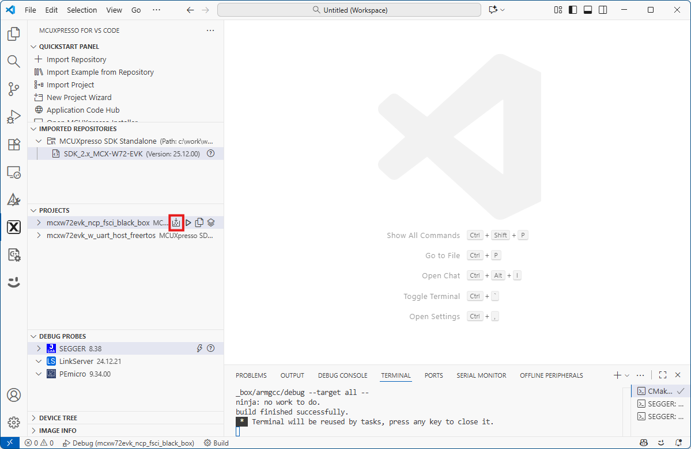
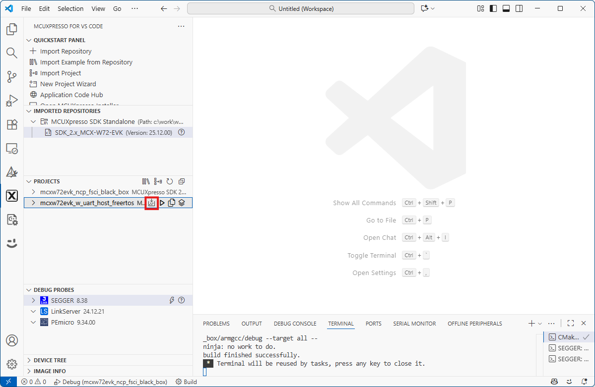
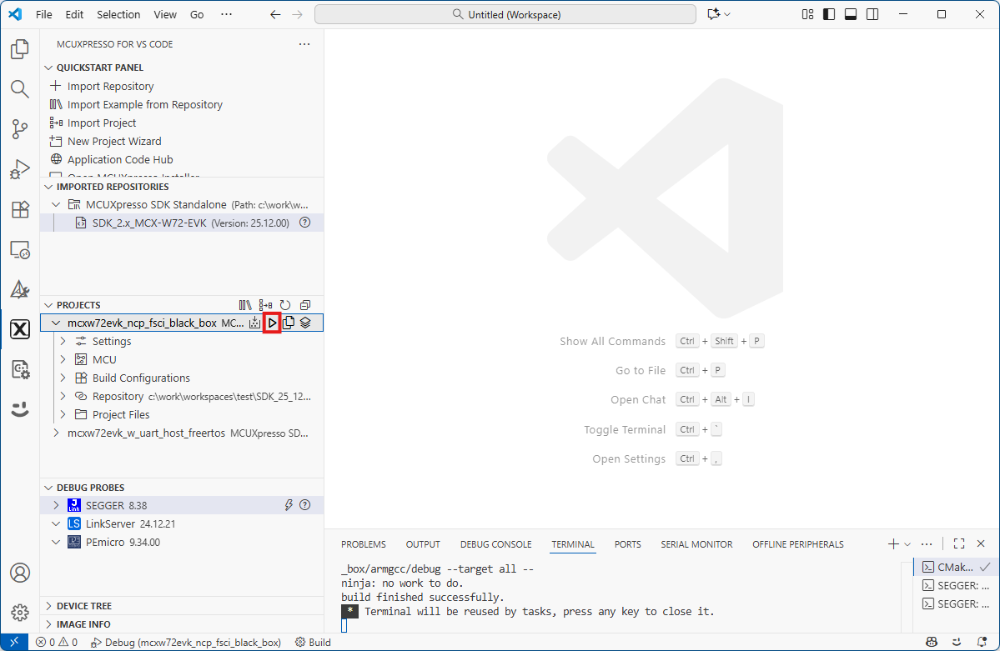
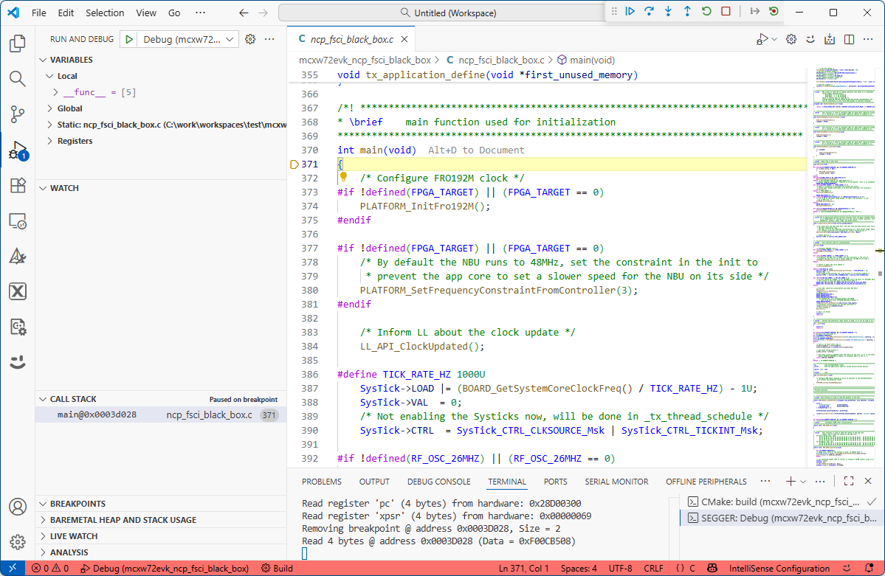
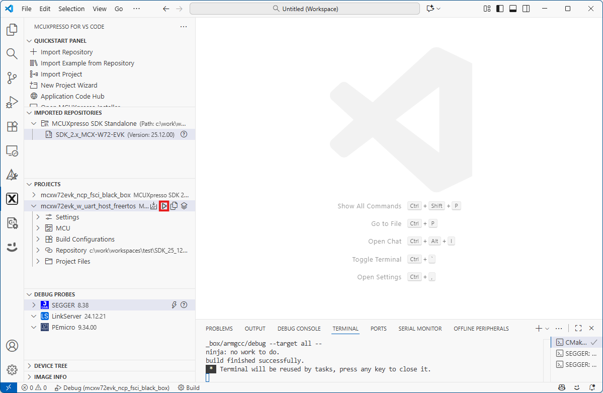
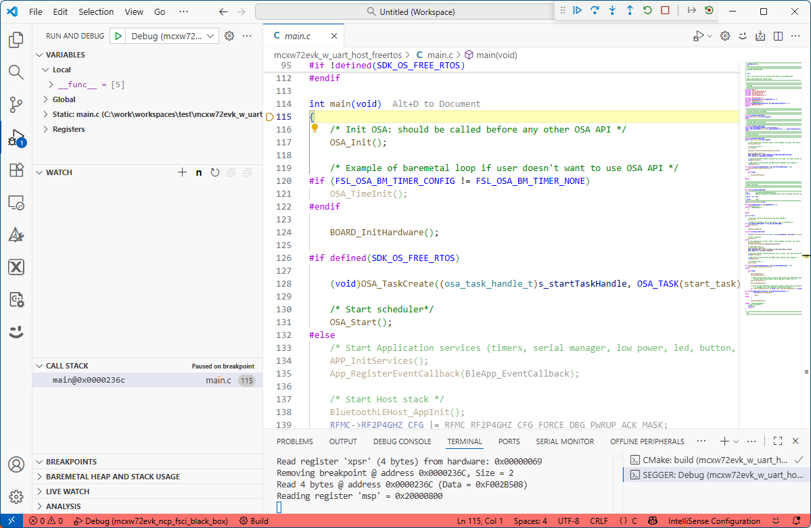

# Building and flashing the BLE Extended NBU software demo applications using Visual Studio Code

To build and flash the BLE software demo applications using Visual Studio Code, follow the steps listed below:

1.  Open Visual Studio Code and open the MCUXpresso for Visual Studio Code extension as shown in the figure below.

    **MCUXpresso for Visual Studio Code extension**
    

2.  Import the SDK package: click “**Import Repository**”. Then, choose the “**Local**” option \(if the SDK is archived use “**Local archive**”\), browse to the path of the SDK you want, and click “**Import**”.

    **Steps to import the SDK**
    

3.  Import NCP(Core1) application: After the SDK is loaded successfully, select the “**Import Example from Repository**” to add an application to your workspace. Choose the repository, toolchain \(Arm GNU\), board, example you want to add, and the location where the VS Code project would be created. Then click “**Import**”.

    **Steps to import the NCP example application**
    

4.  Import Core0 application: After the SDK is loaded successfully, select the “**Import Example from Repository**” to add an application to your workspace. Choose the repository, toolchain \(Arm GNU\), board, example you want to add, and the location where the VS Code project would be created. Then click “**Import**”.

    **Steps to import the Core0 example application**
    

5.  Both Extended NBU applications now appears in the “**Projects**” tab on the left. Build both applications by pressing the “**Build selected**” button on each.

    **Building the NCP FSCI Black Box ThreadX application**
    

    **Building the Wireless UART Host Host FreeRTOS application**
    

6.  After the build is completed successfully, first debug the NBU(Core1) application by clicking the “**Debug**” button.

    **Debug the NCP FSCI Black Box ThreadX application**
    

7.  Press the run \(“**Continue**”\) button to run the application on the board.

    **Running the NCP FSCI Black Box ThreadX application**
    

8.  After the build is completed successfully and the NBU application was successfully written, debug the Core0 application by clicking the “**Debug**” button.

    **Debug the Wireless UART Host FreeRTOS application**
    

9.  Press the run \(“**Continue**”\) button to run the application on the board.

    **Running the Wireless UART Host FreeRTOS application**
    

**Parent topic:**[Building the binaries](../topics/building_the_binaries.md)

