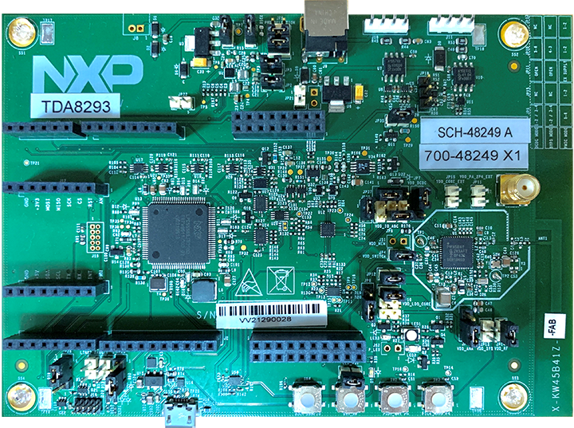
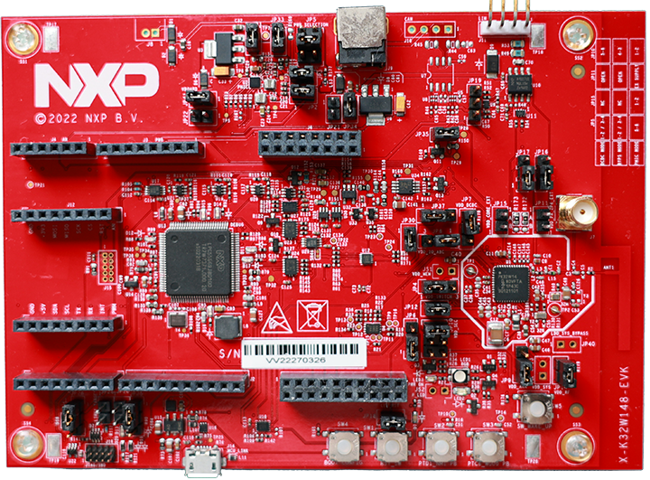
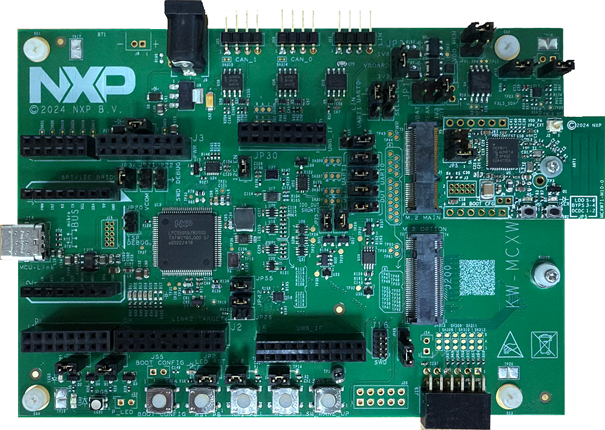
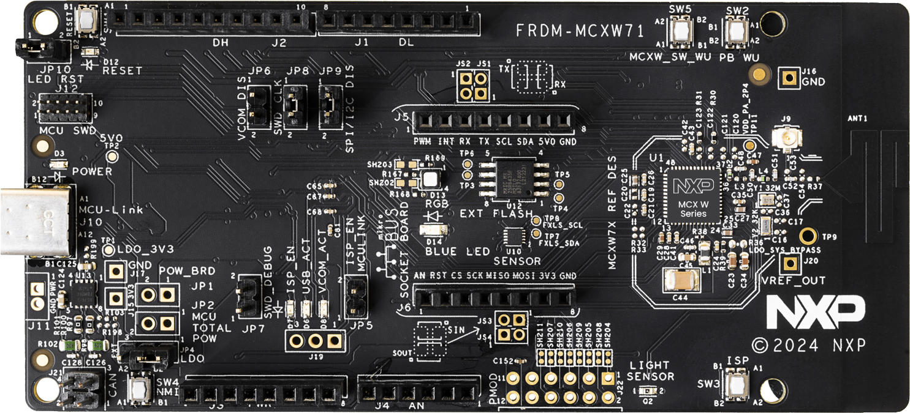
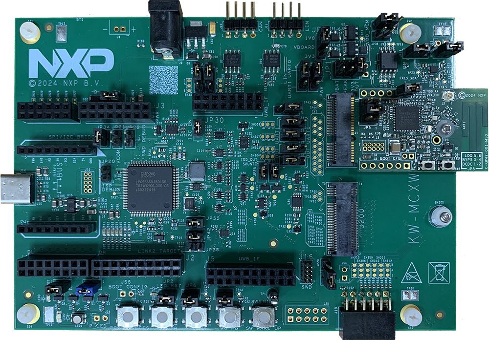
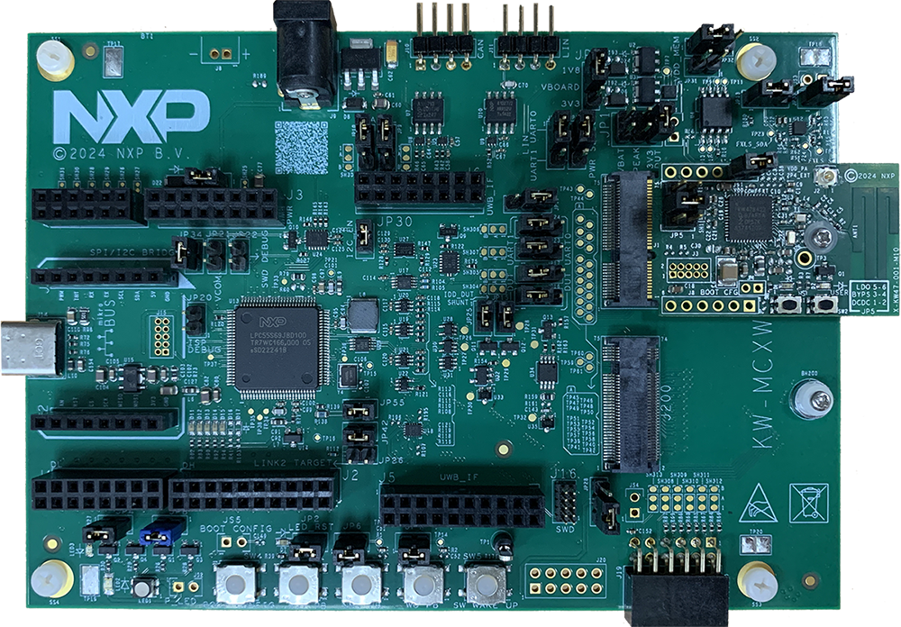

# Hardware setup

The examples described in this document use a KW45B41Z-EVK, KW45B41Z-LOC, K32W148-EVK, MCX-W71-EVK, FRDM-MCXW71, KW47-EVK, KW47-LOC, MCX-W72-EVK, or FRDM-MCXW72 as the development platform, as shown in the figures below.

-   The default interface selected in the IAR Embedded Workbench for Arm projects included in this release is below:
    -   CMSIS-DAP for kw45b41zevk, kw45b41zloc, k32w148evk, mcxw71evk, frdmmcxw71
    -   JLink for kw47evk, kw47loc, mcxw72evk, and frdmmcxw72 platforms
-   Use jumpers to configure the boards in one of the available power configurations \(refer to the specific board documentation\).
-   On all boards, the OpenSDA USB port is connected to a Windows PC. The OpenSDA chip on the board requires flashing with appropriate firmware with debugging and virtual serial COM port capabilities.

**KW45B41Z-EVK board**

**KW45B41Z-LOC board**

**K32W148-EVK board**

**MCX-W71-EVK board**

**FRDM-MCXW71 board**

**KW47-EVK board**

**KW47-LOC board**

**MCX-W72-EVK board**

**FRDM-MCXW72 board**

