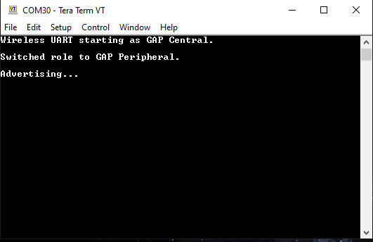
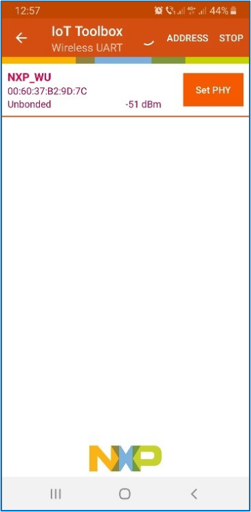

# Running the Wireless UART application using NXP IoT Toolbox mobile application

To run the Wireless UART application using NXP IoT Toolbox mobile application, follow the steps as listed below:

**Note:** Before working on these steps, ensure to install the latest version of the NXP IoT Toolbox mobile application from the application store.

1.  Flash the board with the Wireless UART application as previously described.
2.  Open Tera Term \(or any other Serial Communication software\) and choose **Serial**. Then choose the port of your board and click **OK**. See [Figure 1](#fig_1356g).

    

3.  Stop running the code on the board. Go to **Setup \>Serial Port**. See [Figure 2](#fig_0825ec45-a4db-476b-9848-0e69b1de5431).

    

4.  Choose the required Speed \(baud rate\) and Flow Control values. Here, the baud rate should be 115200 and the Flow control mode should be set to **Xon/Xoff**.

    

5.  Ensure that the Bluetooth device of your phone is enabled.
6.  Open the *IoT Toolbox* application and select the ***Wireless UART*** icon, as shown in [Figure 4](#fig_3b93afc9-a499-44b4-b009-e430b410f8fa).

    

7.  Now run the application on the board. On this step, the RGB LED blinks white quickly. Press the button **SW3** to switch to Peripheral \(Central\) mode, then press **SW2** to start Advertising \(scanning\). The Tera Term terminal shows the message shown in [Figure 5](#fig_7c920386-4633-49a4-b980-d0461de64069).

    

8.  The device should become visible for the Wireless UART mobile application, as shown in [Figure 6](#fig_evy_j3f_2zb).

    

9.  Select the device that appears in the **Wireless UART** tab to connect to it. After connecting, the mobile application shows the console, as shown below. Users can choose between the Wireless Console and Wireless UART tabs. ****

    The device should become visible for the Wireless UART mobile application, as shown in [Figure 7](#fig_23d69e22-c526-42c0-9de7-bb2981a0405b).

    

10. On the IoT Toolbox Wireless application console, the message is introduced in one line and sent to the peer. If Wireless UART mode is used, communication is done character by character. On Tera Term, the message received is displayed. One character at a time can be sent from Tera Term to the peer. When the mobile application receives the character, it displays it.

    The [Figure 8](#das35gd1325_connectedmode) shows the board acting as a peripheral, connected to a phone using IoT Toolbox in Wireless Console and Wireless UART modes.

    

