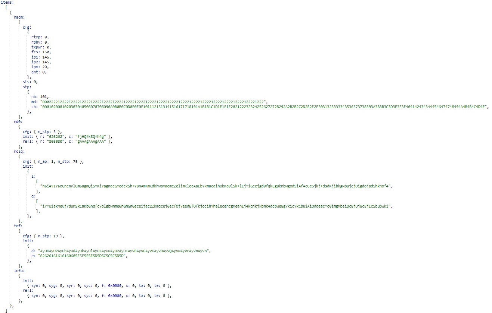

# Firmware response interpretation

Each CS measurement produces results represented as a JSON-like structure terminated with "\[DONE\]".

The "system verbosity" command controls the verbosity of the output.

An example response of a "range" command with default \(minimal\) verbosity, showing mainly the distance computation results \(‘cde’ and ‘ad’ fields in meters\), without any additional data is shown below:

```
items:[{mciq:{cfg:{n_ap:4,n_stp:79},result:{vf:79,cde:0.64,cqi:0.842},},tof:{cfg:{n_stp:13},result:{ad:0.3,sr:100},},},]
CRC32:1cebcbcb
marker:[DONE]
```

An example response of a "range" command is shown below:

```
items:[{hadm:{cfg:{rtyp:0,rphy:0,txpwr:0,fcs:150,ip1:145,ip2:145,tpm:20,ant:0},
sts:0,stp:{nb:101,md:'0002222122221222212222122221222212222122221222212222122221222212
2221222212222122221222212222122221222',
ch:'0001020001020303040506070708090A0B0B0C0D0E0F0F1011121313141516171718191A1B1B1C1D1E1
F1F2021222323242526272728292A2B2B2C2D2E2F2F3031323333343536373738393A3B3B3C3D3E3F3F40414243
43444546474748494A4B4B4C4D4E'}},
md0:{cfg:{n_stp:3},init:{r:'626262',c:'fjHQfkSQfh4g'},refl:{r:'808080',c:'gAAAgAAAgAAA'}},
mciq:{cfg:{n_ap:1,n_stp:79},init:{i:['n6i4YIY6oGncnylGm6agmQiSYKiYagmacGYedckSh+Y8nAmKmKdkhwaMae
meZelimKleaAaEbYkmacaihOkKa0lSk+lEjYiGcejgd0fqkEg8kmbWgodSiAfAcGcSjkj+dsdKjibkgMb8jcjOigdojadShkhof4',],
q:['iYYUiakMeujYdumSkCaKbGnqfcYolgbwmme6nGmGnGeceijac2Zkmqcej6ecfOjYeedEfOfkjocihYhalecehcgMeah
Ij4kqjkjkbmk4dcbWe8gYkicYkCbuiAiQdoeacYc0imgMbeiQc8jUj8cEjIcSbubwki',],},},tof:{cfg:{n_stp:19},init:
{d:'AyUOAyUVAyUbAyUdAyUkAyUlAyUsAyUwAyU2AyU+AyVBAyVGAyVKAyVOAyVQAyVWAyVcAyVnAyVn',r:'62626161616160605F5F5E5E5D5D5C5C5C5D5D'},},
info:{init:{syn:0,syg:0,syr:0,syc:0,f:0x0000,x:0,ta:0,te:0,},
refl:{syn:0,syg:0,syr:0,syc:0,f:0x0000,x:0,ta:0,te:0,},},},]
marker:[DONE]
```

These responses have an albeit slightly modified YAML syntax. The modifications are: ": " is replaced with ":" and indentation/end-of-lines are removed by using the YAML data stream syntax. This reduces the output size to a minimum.

Online YAML beautifier tools can be used \(after adding a space after double-colons\) to convert them into a more readable format.

The above example is shown below:



At the top level, we have the *items*, *profiling*, and *marker* elements. The marker element is there to signal the end of the message.

The profiling element contains timing related information about the CS procedure.

The items element is a list of *range-result* blocks. The parameters in range-result block are shown in the table below.

**Table. Wireless ranging response structure**

| Hierarchy                    | Parameter      | Unit    | Description                                             |
| ---------------------------- | -------------- | ------- | --------------------------------------------------------|
| Init/refl                    | u              | \-      | Unique ID of board (required)                           |
| Init/refl                    | v              | \-      | SW Version (required)                                   |
| **CS configuration**                                                                                              |
| hadm                         | sts            | \-      | CS event status (0 = OK)                                |
| hadm.cfg                     | rtyp           | \-      | CS rtt_type configured                                  |
| hadm.cfg                     | rphy           | \-      | CS rtt_phy configured                                   |
| hadm.cfg                     | fcs            | µs      | CS T_FCS configured                                     |
| hadm.cfg                     | ip1/ip2        | µs      | CS T_IP1/T_IP2 configured                               |
| hadm.cfg                     | tpm            | µs      | CS T_PM configured                                      |
| **CS steps configuration**                                                                                        |
| hadm.stp                     | nb             | #       | Number of steps of CS event                             |
| hadm.stp                     | md             | #       | Step mode array of the CS event (0-3)                   |
| hadm.stp                     | ch             | #       | Channel number mode array of the CS event (0-79)        |
| **CS mode 0 config and results**                                                                                  |
| hadm.stp                     | evt            | #       | CS subevent event index (2 hex digits per CS subevent)  |
| hadm.stp                     | se             | #       | Last CS step index of each CS subevent (2 hex digits per CS subevent) |
| hadm.md0.cfg                 | n_stp          | #       | Number of mode 0 steps                                  |
| hadm.md0.init/refl           | r              | dBm     | Mode 0 RSSI array of n_stp steps                        |
| hadm.md0.init/refl           | c              | Hz      | Mode 0 CFO array of n_stp steps                         |
| **MCIQ (RTP) results**                                                                                            |
| mciq.cfg                     | n_ap           | #       | Number of antenna paths for RTP (<=4)                   |
| mciq.cfg                     | n_stp          | #       | Number of steps containing PCTs (step modes 2 and 3)    |
| mciq.init/refl               | i              | \-      | List of base64 encoded 12 bit PCT I values, that is, for each tone there are 2 characters, each representing 6-bits of data (required, length=n_stp); Repeated per antenna path |
| mciq.init/refl               | q              | \-      | List of base64 encoded 12-bit PCT Q values, that is, for each tone there are 2 characters, each representing 6-bits of data (required, length=n_stp); Repeated per antenna path |
| mciq.init/refl               | tqi            | \-      | List of TQI values for each tone; Repeated per antenna path |
| mciq.result                  | cde, cqi       | m, #    | CDE distance estimation and quality indicator computed by embedded algorithm |
| mciq.result                  | vf             | #       | Number of valid frequencies retained by distance estimation algorithms |
| mciq.result                  | rade, rade_dqi | m, #    | RADE distance estimation and quality indicator computed by embedded algorithm |
| **ToF (RTT) results**                                                                                             |
| tof.cfg                      | n_stp          | #       | Number of steps containing RTT packets (step modes 1 and 3) |
| tof.init/refl                | d              | ns      | List of base64 encoded 18 bits + 4 error bits ToA-ToD or ToD-ToA values, resulting in 4 characters each (required, length=n_stp) |
| tof.init/refl                | r              | dBm     | Mode 1 or 3 packet RSSI array (required, length=n_stp)  |
| tof.result                   | ad, sr         | m, %    | Average distance estimation and success rate as computed by embedded algorithm |
| tof.init/refl                | \| nadm        | \| - \| | Estimated chance of an attack on the received packet based on the normalized attack detector metric (NADM) |
| **CS measurement info**                                                                                           |
| info.init/refl               | syn            | #       | Mode 0 index in sequence that was used to synchronize gain and frequency |
| info.init/refl               | syg            | #       | AGC index used during whole CS event (<= 11)            |
| info.init/refl               | syr            | dBm     | RSSI of mode 0 used for gain lock                       |
| info.init/refl               | syc            | Hz      | CFO of mode 0 used for CFO compensation                 |
| info.init/refl               | f              | \-      | Error/warning flag (see description below)              |
| info.init/refl               | te             | \-      | Reserved for future use                                 |

The table below shows the "info" error flags bit field description.  

**Table: Info error flags interpretation**
| Bit Mask | Comment                                                         |
| -------- | --------------------------------------------------------------- |
| 0x0001   | PLL lock error                                                  |
| 0x0002   | CS sequence was aborted                                         |
| 0x0004   | Error during AGC lock                                           |
| 0x0008   | Error during IQ capture                                         |
| 0x0010   | RSSI measured became too low                                    |
| 0x0020   | Error happened during Mode 0 synchronization phase              |
| 0x0040   | Timestamp reading on one or more RTT packets failed             |
| 0x0080   | SW scheduler detected a desynchronization with RSM HW scheduler |
| 0x0100   | XCVR API reported an error                                      |

Use the script `record_range_measurement.py` to decode this data and obtain numerical values. We do not provide the encoding method of the compressed fields here.

**Table: CSV fields description**
| Field                    | Description |
| ------------------------ | ----------- |
| meta.error_msg           | Application error message. |
| meta.testcase.meas_nr    | Ranging measurement number. |
| mciq.cfg.n_ap            | Number of antenna paths used during CS mode 2 or mode 3 steps. Typically 1 for the single antenna mode, 4 for 2x2 antenna mode. |
| mciq.cfg.n_stp           | Number of CS RTP steps (mode2 or mode3) included in the CS procedure. |
| mciq.result.CDE_distance | CDE distance estimate in meters. |
| mciq.result.CDE_dqi      | CDE distance quality indicator between 0 and 1. |
| mciq.result.RADE         | RADE distance estimate in meters. |
| mciq.result.RADE_dqi     | RADE distance quality indicator between 0 and 1. |
| mciq.result.RADE_error   | RADE error status. |
| mciq.result.distance     | Distance estimate in meters. |
| mciq.result.slope_rmse   | IQ samples quality metric in degree. 2-way phase slope root mean square error. |
| tof.cfg.n_stp            | Number of CS RTT steps (mode1 or mode3) included in the CS procedure. |
| tof.result.distance      | RTT distance estimate in meters. |
| tof.result.successrate   | How many CS RTT packets were sucessfully exchanged during the CS procedure, in %. |
| tof.result.init_nadm     | Initiator Normalized Attack Detector Metric. |
| tof.result.refl_nadm     | Reflector Normalized Attack Detector Metric. |
| tof.result.std           | Standard deviation of the distance computed over all CS mode 1 steps. |
| md0.cfg.n_stp            | Number of CS mode 0 steps (Synchronization) included in the CS procedure. |
| hadm.cfg.rtyp            | Channel sounding RTT Type. |
| hadm.cfg.rphy            | Channel sounding RTT PHY (0 = 1Mbps, 1 = 2Mbps). |
| hadm.cfg.txpwr           | TX power used during the CS procedure, in dBm. |
| hadm.cfg.fcs             | Channel sounding T_FCS, in µs. Frequency change period. |
| hadm.cfg.ip1             | Channel sounding T_IP1, in µs. Defined for the CS mode 0 and CS mode 1 : idle time between the transmission from the initiator and the transmission from the reflector. |
| hadm.cfg.ip2             | Channel sounding T_IP2, in µs. Defined for the CS mode 2 : idle time between the transmission from the initiator and the transmission from the reflector. |
| hadm.cfg.tpm             | Channel sounding T_PM, in µs. Phase measurement period (CS mode 2). |
| hadm.sts                 | Channel sounding measurement status. |
| hadm.stp.nb              | Channel sounding number of executed steps. |
| hadm.stp.modes           | The list of Channel Sounding modes used for each step. |
| hadm.stp.channels        | The list of Channel Sounding channel numbers used for each step. |
| hadm.stp.event           | Index of last event number. |
| hadm.stp.subevt          | Index of last subevent number. |
| hadm.stp.m0_idx          | The list of indexes for the steps that use mode 0 procedures. |
| hadm.stp.tof_idx         | The list of indexes for the steps that use ToF procedures. |
| hadm.stp.mciq_idx        | The list of indexes for the steps that use phase based procedures. |
| info.init.sync_step_id   | Initiator side. Which step index has been used during the synchronization (CS mode 0) to capture the receiver gain index, the RSSI and the CFO. |
| info.init.sync_agc       | Initiator receiver gain index selected for the CS procedure. |
| info.init.sync_rssi      | Initiator RSSI in dBm. |
| info.init.sync_cfo       | Initiator measured Carrier Frequency Offset before compensation, in Hz. |
| info.init.flags          | Initiator error flags (refer to SDK documentation 'CS wireless ranging demo application.pdf') |
| info.init.temperature    | Temperature of initiator device during measurement. |
| info.refl.sync_step_id   | Reflector side. Which step index has been used during the synchronization (CS mode 0) to capture the receiver gain index, the RSSI and the CFO. |
| info.refl.sync_agc       | Reflector receiver gain index selected for the CS procedure. |
| info.refl.sync_rssi      | Reflector RSSI in dBm. |
| info.refl.sync_cfo       | Reflector measured Carrier Frequency Offset before compensation, in Hz. |
| info.refl.flags          | Reflector error flags (refer to SDK documentation 'CS wireless ranging demo application.pdf') |
| info.refl.temperature    | Temperature of reflector device during measurement. |

**Parent topic:**[Main menu](../topics/main_menu.md)

