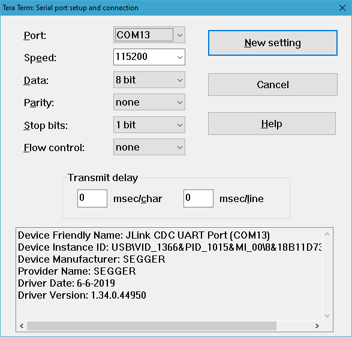
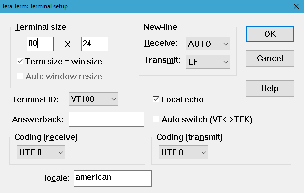

# Serial console setup

Wireless ranging application can be used either by using a console or by using a Python script environment. To use the console, connect to each device COM port with Tera Term using the setup \(putty is not supported\), as shown in the figure below.

**Figure: Tera Term configuration for operating with wireless ranging**
  

**Parent topic:**[Wireless ranging demo application setup](../topics/wireless_ranging_demo_application_setup.md)

