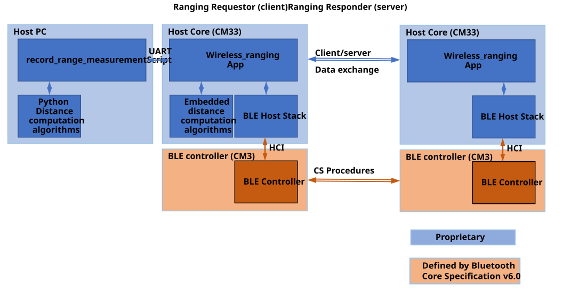
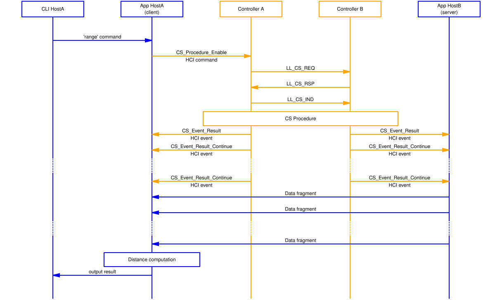

# Wireless ranging and channel sounding standardization

In this chapter, we are highlighting which part of wireless ranging application complies with a standard and which one does not.

The Bluetooth Low Energy SIG defines two standards:

-   Channel sounding is defined by the core working group. It defines the behavior of the Bluetooth Low Energy controller and how to interface it for CS features. The specification covers how the CS feature must be implemented in a Bluetooth Low Energy controller.
-   Ranging service and profile \(RASP\) is defined by the "Direction Finding" working group. It defines an architecture \(client/server\) and a Bluetooth Low Energy profile for applications that require to operate Channel Sounding feature.

The Bluetooth Low Energy SIG *does not* define any sort of distance computation method. Wireless ranging application provides two sample algorithms to demonstrate the full ranging concept. The first is CDE, an embedded implementation with low complexity. The second one is RADE, which provides an essential compromise between complexity and performance. As mentioned previously, wireless ranging Python framework ensures that a user can develop their own signal processing algorithm using the real IQ datasets.

Wireless ranging is based on channel sounding core specifications, as mentioned in the associated SDK release note. It does not implement RASP specification. The figure below shows the application architecture with a colored overlay of what is defined by the standards.  

**Figure: Wireless ranging software architecture and channel sounding overlay**

Similarly, the figure below shows a sequence chart highlighting a single measurement sequencing with colored overlay. The steps defined by the standard are highlighted in orange.

**Figure: Wireless ranging software flow diagram and channel sounding overlay**

**Parent topic:**[Appendices](../topics/appendices.md)

