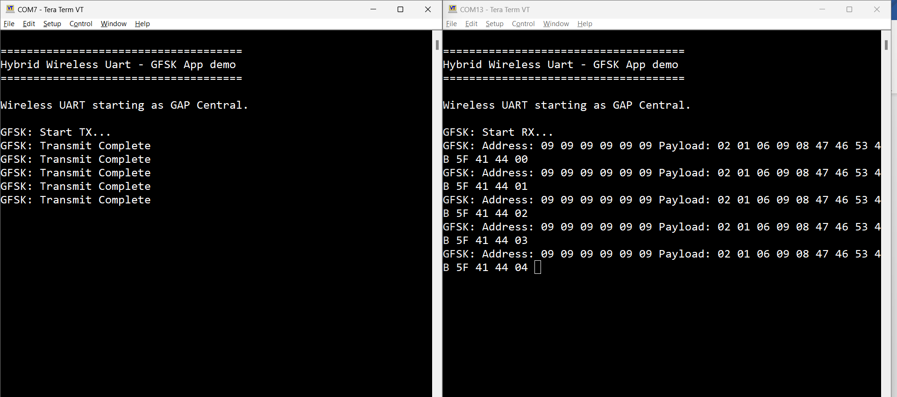

# Case 2 \(Generic FSK\)

When operating the Generic FSK mode, the following steps should be followed.

1.  Open a serial port terminal and connect them to the two boards, in the same manner described in [Testing devices](../testing_devices.md). The start screen after the board is reset is the same as in [Figure 1](case_1_bluetooth_le.md#fig_c1d_pwl_ldc).

2.  The Generic FSK communication direction is not preset. To start receiving, double click the **SCANSW** button on one board. Then, the device starts receiving packets on the same channel as the Bluetooth LE channel 37.

3.  To start transmitting, long press the **ROLESW** button on the other board. The transmitting device uses an identifier known by the receiver and its packets are displayed in the CLI as shown in [Figure 1](#fig_aea85897-0793-4bc2-b46f-b9117236a8bf):

    

4.  To stop Generic FSK reception, double click the **ROLESW** button.
5.  To stop the periodic Generic FSK transmit operation, long press the **ROLESW** button again, if the transmit procedure is ongoing. The long press of the **ROLESW** button acts as a toggle for the transmit. At this point, both devices can reverse the direction of communication by following the exact same steps.

    See [Figure 2](#fig_35752aca-c9b5-4829-bc65-ed4976eb92e2).

    

**Parent topic:**[Usage](../../topics/FSK/usage.md)

