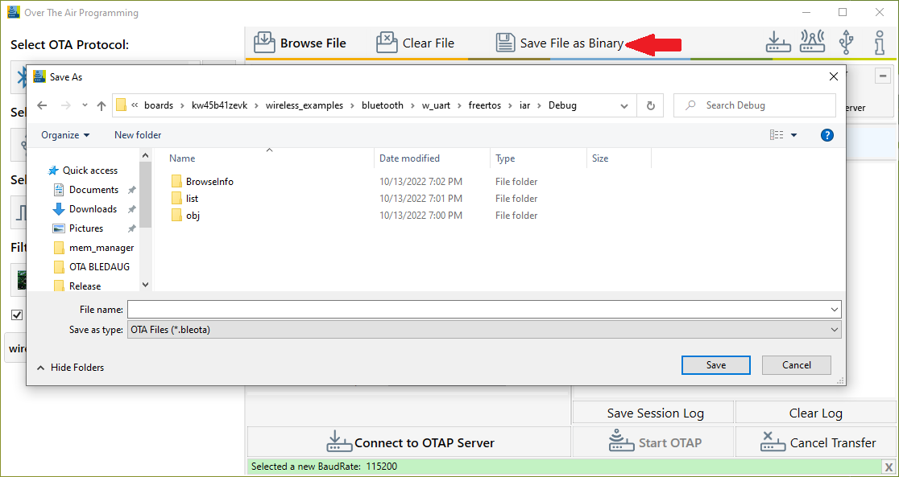
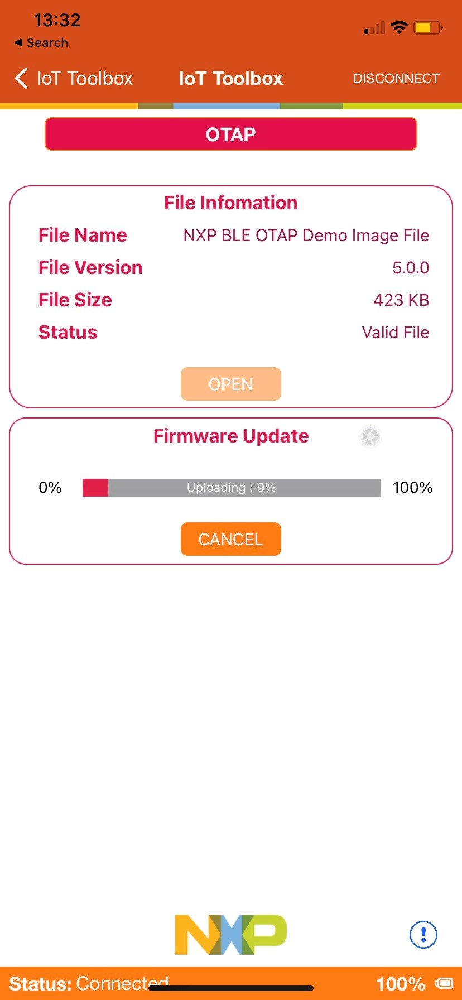

# Usage with IoT Toolbox

This is the list of requirements.

-   **Mobile device** running **Android** platform or **iOS** with hardware and software supporting **Bluetooth 4.0 and later**.
-   **Kinetis Bluetooth LE Toolbox** application – download from the specific application store for your device.

To run the application, perform the following steps:

1.  Flash the OTAP Client ATT to either the KW45B41Z-EVK or the K32W148-EVK platform. The Kinetis Bluetooth LE Toolbox only supports the ATT OTAP Client.
2.  In order to send over the air in `.bleota` format, create the application. In order to load the image file into the Over the Air Programming application and create the .sb3 file, follow the instructions described in [Usage with Over The Air Programming Tool](usage_with_test_tool_for_connectivity_products_002.md). See [Figure 1](#FIG_ZFJ_LWR_QSB) Once the `.sb3` file is created, press the "**Save File as Binary**" button to create the `.bleota` file.

    

3.  Start the **Kinetis Bluetooth LE Toolbox**application on your mobile device and start the **OTAP Tool**. The application starts scanning.
4.  Press **ADVSW** on the board to start Advertising on the embedded OTAP Client application. The device should show up in the list of scanned devices. Touch the device in the scan list to connect to and the application performs service discovery and displays some information shown in the [Figure 2](#FIG_NHV_F4X_SSB).

    

5.  Press the “**Open**” button and load the `.bleota` file to be sent over-the-air. Once the file is loaded, some information about it is displayed. Press the “**Upload**” button to start the image transfer process. A progress bar is shown while the image transfer is ongoing. The progress bar displays 100% update after a successful transfer, as shown in [Figure 3](#BLEDAUG3024).

    

6.  After the image transfer is complete, the OTAP Client triggers the bootloader and resets the MCU. The bootloader takes about 30 seconds to flash the image on the board. After this time passes, the MCU resets again and runs the new image.

**Parent topic:**[Over the Air Programming \(OTAP\)](../topics/over_the_air_programming_otap.md)

