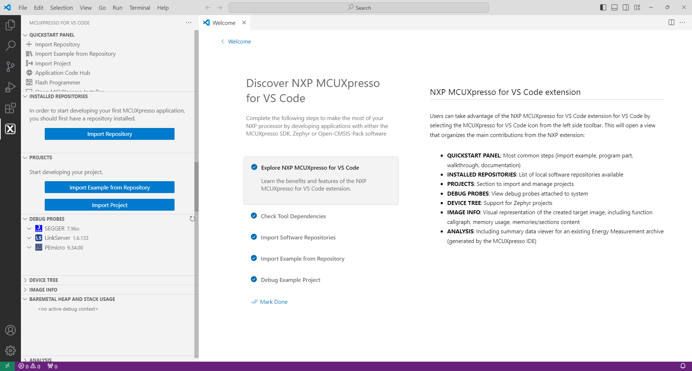
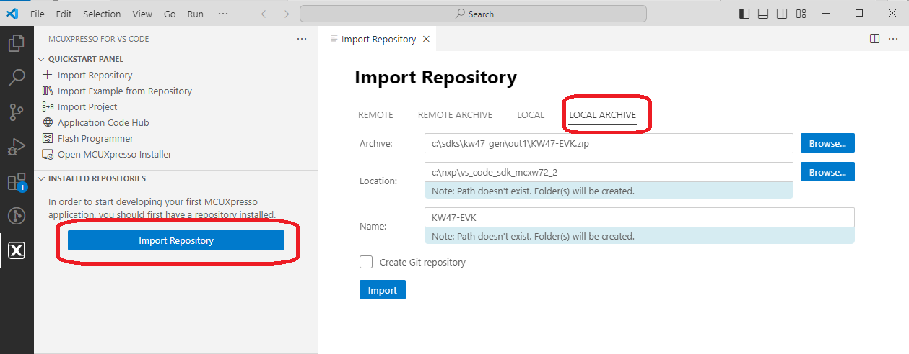
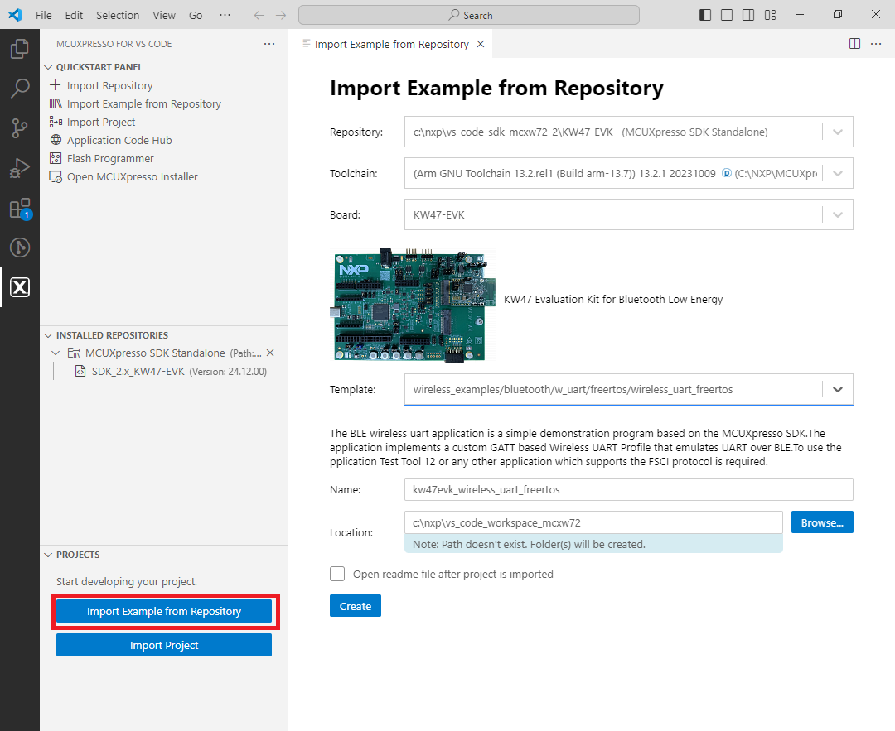
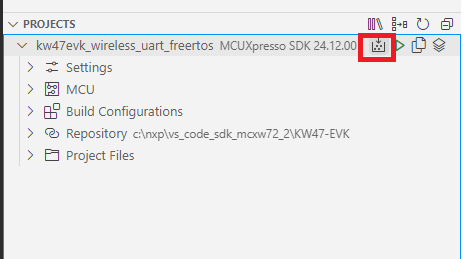
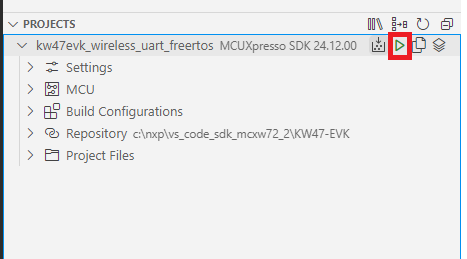
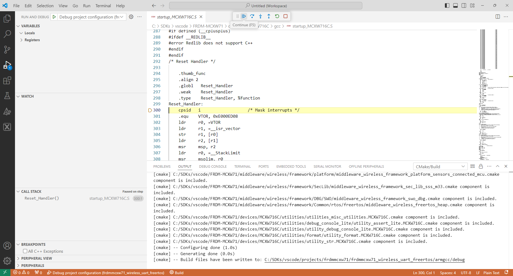

# Building and flashing the BLE software demo applications using Visual Studio Code

To build and flash the BLE software demo applications using Visual Studio Code, follow the steps listed below:

1.  Open Visual Studio Code and open the MCUXpresso for Visual Studio Code extension.

    

2.  Import the SDK package: click “**Import Repository**”. Then, choose the “**Local**” option \(if the SDK is archived use “**Local archive**”\), browse to the path of the SDK you want, and click “**Import**”.

    

3.  After the SDK is loaded successfully, select the “**Import Example from Repository**” to add an application to your workspace. Choose the repository, toolchain \(Arm GNU\), board, example you want to add, and the location where the VS Code project would be created. Then click “**Create**”.

    

4.  The application now appears in the “**Projects**” tab on the left. Build the application by pressing the “**Build selected**” button.

    

5.  After the build is completed successfully, debug the application by clicking the “**Debug**” button.

    

6.  Press the run \(“**Continue**”\) button twice to run the application on the board.

    

**Parent topic:**[Building the binaries](../topics/building_the_binaries.md)

